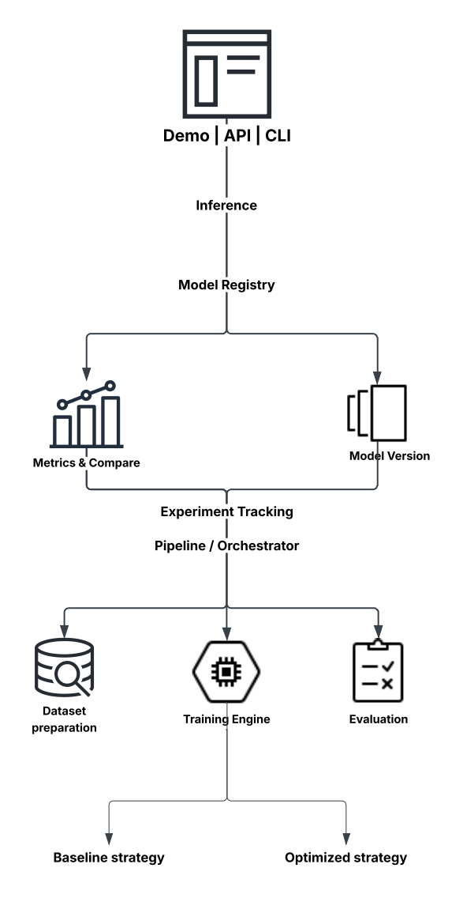

# Arquitectura MLOps para el fine-tuning eficiente de modelos avanzados de inteligencia artificial

## Resumen / Abstract

Adaptar un modelo avanzado de inteligencia artificial a una tarea concreta exige coordinar datos, configuración, entrenamiento, evaluación, versionado y, exposición del modelo para su uso. Cuando esas etapas se ejecutan de forma manual y desconectada, el fine-tuning se vuelve costoso en tiempo y GPU, difícil de reproducir y poco comparable entre estrategias: no queda evidencia controlada de si una configuración más eficiente reduce recursos sin degradar de manera significativa la calidad.

El presente proyecto, denominado **Tune**, propone diseñar e implementar un **laboratorio MLOps** (prototipo académico) que automatice el ciclo de fine-tuning, registre cada corrida y permita comparar de forma explícita una estrategia **baseline** (fine-tuning estándar, típicamente más costosa) con una estrategia **optimizada** (por ejemplo LoRA, precisión mixta o early stopping). El modelo seleccionado se registra y se expone mediante una API o CLI de inferencia, incluyendo la versión utilizada. Tune no pretende ser una plataforma comercial tipo SageMaker, sino un entorno reproducible y acotado para medir eficiencia.

El alcance se limita a un prototipo con un mínimo experimental de **un modelo preentrenado, un dataset y dos estrategias**. El modelo concreto (incluido un caso geoespacial si resulta viable) valida la arquitectura; no la define. Quedan fuera el preentrenamiento de foundation models, el multi-tenancy productivo y una interfaz compleja.

El desarrollo seguirá **prototipado iterativo**: pipeline baseline, tracking y registry, estrategia optimizada con comparación, automatización extremo a extremo, API de inferencia y validación. Se espera responder, con métricas de tiempo, memoria, GPU-hours y calidad, a la pregunta: *¿es posible adaptar este modelo usando menos recursos sin perder significativamente calidad?*

---

# 1. Introducción

El desarrollo de modelos fundacionales y de modelos avanzados de inteligencia artificial ha desplazado una parte creciente del esfuerzo práctico desde el entrenamiento masivo hacia la **adaptación**. En investigación, industria y formación en ingeniería de sistemas, el software ya no se limita a ejecutar un algoritmo: orquesta datos versionados, experimentos, métricas, artefactos y servicios. Tendencias como el aprendizaje por transferencia, las técnicas de adaptación eficiente de parámetros (PEFT), el entrenamiento en precisión mixta y las prácticas **MLOps** reflejan esa transición. El rol de los sistemas de información en este dominio es hacer que el ciclo (preparar datos, entrenar, evaluar, registrar y desplegar) sea trazable y repetible, no un conjunto de scripts aislados.

En la situación actual, quienes necesitan especializar un modelo preentrenado suelen enfrentarse a un mercado polarizado. En un extremo están las plataformas cloud empresariales, capaces de entrenar, comparar y servir modelos, pero con costo, complejidad y curva de adopción desproporcionados para un equipo académico o de prototipado. En el otro, notebooks y scripts manuales permiten “hacer fine-tuning”, pero no dejan una evidencia comparable: rara vez se sabe con precisión qué dataset, código y parámetros originaron un resultado, ni si una estrategia “más barata” sacrificó demasiado la calidad. El impacto recae sobre estudiantes, ingenieros e investigadores que gastan GPU-hours difíciles de recuperar, no pueden defender una comparación y dejan el modelo entrenado desconectado de cualquier uso real.

La necesidad técnica identificada no es la ausencia de un modelo o de una herramienta de entrenamiento. Existen frameworks (PyTorch, Hugging Face, TerraTorch), técnicas de eficiencia (LoRA, QLoRA, mixed precision) y sistemas de tracking (MLflow). Lo que falta con frecuencia es una **arquitectura integrada y acotada** que, en un mismo flujo, ejecute un baseline, ejecute una estrategia optimizada, registre tiempo, memoria y calidad, y deje el modelo resultante consumible. Esa carencia abre una oportunidad de diseño: un laboratorio MLOps pequeño, defendible y medible, que separe la infraestructura (qué se ejecuta y cómo se compara) de las técnicas de optimización (qué se mide).

A partir de esta oportunidad se propone **Tune**, un prototipo de laboratorio para fine-tuning eficiente. Sus funcionalidades clave son la ejecución reproducible de dos estrategias sobre el mismo dataset y el mismo modelo preentrenado, el registro de parámetros y recursos, la comparación baseline versus optimizado, el versionado en un model registry y la inferencia mediante API o CLI. El impacto esperado es disponer de evidencia experimental sobre si una estrategia reduce recursos sin degradar de forma significativa la calidad, y cerrar el ciclo llevando el modelo elegido hasta un servicio usable.

---

# 2. Planteamiento del problema

## 2.1 Descripción del problema

Fine-tunear un modelo avanzado implica coordinar un dataset etiquetado, un modelo preentrenado, hiperparámetros, cómputo GPU, evaluación y versionado. En equipos académicos y de I+D de alcance limitado, ese proceso suele realizarse de manera **manual y fragmentada**. La consecuencia no es teórica: se pierde la capacidad de explicar, repetir y comparar lo que ocurrió.

Las causas principales son tres. Primera, el costo y la duración del entrenamiento (tiempo de reloj, memoria GPU, GPU-hours) desalientan iterar y empujan a aceptar la primera corrida que “funciona”. Segunda, las herramientas existentes cubren fragmentos del ciclo (entrenar, registrar o servir) pero no obligan a confrontar de forma controlada una estrategia estándar con una estrategia eficiente. Tercera, el modelo que resulta del experimento rara vez se convierte en un componente de software versionado: queda un archivo en disco, desligado del registro de la corrida.

La población afectada son estudiantes, ingenieros e investigadores que deben adaptar modelos avanzados **sin** una plataforma enterprise completa. En ese contexto, comparar “entrenamiento caro” frente a “entrenamiento barato” se vuelve informal; no hay una tabla defendible de tiempo, memoria y calidad; y no es posible afirmar con rigor si el ahorro sacrificó demasiado el desempeño. El estado negativo, por tanto, es un fine-tuning **costoso, poco reproducible y poco comparable**, con un quiebre entre experimentación y uso.

El problema puede sintetizarse así:

> **El fine-tuning de modelos avanzados de inteligencia artificial tiende a ser costoso en tiempo y recursos, y difícil de reproducir y comparar entre estrategias. Quienes lo realizan de forma manual no disponen de evidencia controlada sobre si una configuración más eficiente reduce GPU y tiempo sin degradar de manera significativa la calidad, y el modelo entrenado suele quedar desconectado de un servicio de inferencia usable.**

La problemática no consiste en hacer falta una plataforma tipo SageMaker, ni en la inexistencia de un modelo concreto. Existen modelos preentrenados, datasets públicos y técnicas de eficiencia. La oportunidad es **organizar y medir** el proceso de adaptación de forma transferible a distintos modelos y tareas, no inventar un foundation model nuevo.

## 2.2 Justificación

Atender este problema es pertinente en lo técnico porque el fine-tuning eficiente (PEFT, precisión mixta, acumulación de gradientes, early stopping) es un tema activo, pero su efectividad depende del modelo, la tarea y el hardware. Medirlo dentro de un pipeline reproducible aporta evidencia concreta en lugar de asumir que “lo optimizado siempre es mejor”.

Es pertinente en Ingeniería de Sistemas porque el proyecto integra arquitectura de software, datos, automatización, experiment tracking, model registry y servicios de inferencia. El aporte no se reduce a entrenar un modelo: se evalúa la interacción entre componentes que permiten ejecutar, registrar, comparar y servir.

Es defendible académicamente porque se separa la **infraestructura MLOps** (lo que habilita corridas comparables) de las **técnicas de optimización** (lo que, si existe, explica el ahorro). No se atribuye a “la arquitectura” un speedup que en realidad produce LoRA o FP16. Si la estrategia barata no mejora, ese resultado también es válido: Tune sirve para medir.

El enfoque también controla el riesgo de un proyecto académico de duración limitada. Un laboratorio cuyo núcleo es la comparación de estrategias no depende de que un único ecosistema (por ejemplo un foundation geoespacial y su toolkit) funcione de extremo a extremo. El caso de estudio puede ser geoespacial si resulta viable y se reutiliza trabajo exploratorio previo; si el modelo o la GPU lo impiden, se sustituye el caso sin redefinir el proyecto.

## 2.3 Restricciones y supuestos iniciales

El proyecto estará condicionado por las siguientes restricciones y supuestos:

* El proyecto tiene carácter académico y de prototipo funcional; no se busca disponibilidad, seguridad ni escala de una plataforma comercial.
* La GPU disponible limitará el tamaño, el número y la duración de los experimentos.
* Se utilizarán datasets públicos o de uso académico permitido, versionados de forma básica.
* El mínimo viable experimental es **un modelo preentrenado + un dataset + dos estrategias** (baseline y optimizado). Un segundo modelo o dataset es extensión opcional y solo se aborda si el mínimo ya está cerrado.
* El modelo preentrenado no está fijado de antemano. Puede emplearse un caso geoespacial si el cómputo y la madurez del tooling lo permiten; no es dependencia del éxito del proyecto.
* No se construye un equivalente a Hugging Face o SageMaker, ni multi-tenancy, ni facturación.
* La interfaz de usuario, si existe, será mínima (laboratorio visual). El núcleo es pipeline, métricas y API o CLI.
* Kubernetes, multi-cloud y orquestación productiva se documentan como trabajo futuro.
* No se preentrena un foundation model desde cero.
* El uso de infraestructura cloud se considerará únicamente cuando aporte valor a la validación y sea viable según los recursos disponibles.
* La autenticación empresarial (por ejemplo OAuth2 completo), las cuotas de facturación real y el scaling productivo no forman parte del alcance obligatorio.

---

# 3. Alcance del proyecto

El proyecto comprende el diseño e implementación de un **prototipo de laboratorio MLOps (Tune)** para ejecutar, registrar, comparar y servir resultados de fine-tuning eficiente.

**Usuarios previstos.** El equipo del proyecto opera el laboratorio (prepara datos, lanza corridas, interpreta métricas, promueve un modelo). Un consumidor de demo (incluido el jurado o un cliente de prueba) usa la API o CLI para obtener una predicción del modelo aprobado. No se contempla una base de usuarios productivos ni operación post-proyecto.

**Madurez.** Prototipo académico validado, no un producto comercial ni un sistema en producción.

**Entornos.** Pipeline de backend, experiment tracking y registry (MLflow u equivalente), servicio de inferencia y API REST (o CLI + endpoint mínimo). Contenerización básica si aporta a la reproducibilidad o a la demo. Sin aplicación móvil ni frontend complejo.

## Incluye

### Gestión de datasets

* Registro y versionado básico de los datasets usados en los experimentos.
* Metadatos necesarios para reproducibilidad (origen, versión, particiones de entrenamiento y prueba).
* Asociación dataset ↔ experimento ↔ modelo.
* Organización del flujo de datos requerido para entrenamiento y evaluación.

### Motor de fine-tuning y estrategias

* Colocación de un modelo **preentrenado** sobre el dataset elegido (fine-tuning, no entrenamiento desde cero).
* Ejecución de al menos dos estrategias comparables, con configuraciones versionadas y repetibles:
  * **Baseline:** fine-tuning estándar (full fine-tuning o configuración de referencia, más costosa).
  * **Optimizado:** estrategia eficiente (por ejemplo LoRA o QLoRA, mixed precision, gradient accumulation, early stopping, según viabilidad).
* Dos corridas del mismo pipeline, en condiciones documentadas (mismo dataset, mismo conjunto de prueba, mismo hardware de referencia).

### Experiment tracking y model registry

* Registro de parámetros, métricas, artefactos, tiempo y recursos por corrida.
* Versionado de modelos y estados de promoción (trained / evaluated / candidate / approved).
* Asociación de cada versión de modelo con el experimento y el dataset que la originaron.
* MLflow (u equivalente) como columna de tracking y registry.

### Comparación experimental (núcleo del aporte medible)

* Tabla o gráfico baseline versus optimizado con, al menos:
  * tiempo de entrenamiento
  * memoria GPU (pico o promedio, según instrumentación)
  * GPU-hours (o un proxy documentado)
  * métrica(s) de calidad de la tarea, medidas sobre el mismo conjunto de prueba
* Interpretación explícita: la arquitectura habilita la comparación; la estrategia explica el ahorro, si existe.
* Umbral de calidad aceptable documentado **antes** de interpretar los resultados, para no ajustar el criterio a posteriori.

### Evaluación y promoción

* Evaluación automática del modelo al cierre de cada corrida.
* Criterios verificables para decidir si una versión avanza a candidate o approved.
* Rechazo explícito de corridas que no cumplan los criterios o que no puedan asociarse a un run trazable.

### Despliegue e inferencia

* Empaquetado del modelo seleccionado (contenedor si aporta a la demo).
* Servicio de inferencia integrado con el model registry.
* API REST (o CLI + endpoint mínimo) para consumir el modelo, incluyendo la versión en la respuesta.
* Endpoints mínimos previstos: `/health`, `/model` y `/predict` (o equivalentes).
* El servicio predice; no lanza entrenamientos ni comparaciones.

### Validación y demo

* Reproducibilidad de al menos un experimento.
* Funcionamiento del pipeline extremo a extremo.
* Demo de comparación y consumo del modelo.
* Si el caso de estudio es visual (por ejemplo imágenes satelitales), puede mostrarse la predicción sobre el input —imagen original, etiqueta y máscara o clase predicha; y, si aporta, baseline versus optimizado sobre la misma muestra—. Ello ilustra el caso y el cierre de ciclo; no sustituye las métricas de eficiencia.

## No incluye

* Preentrenamiento de foundation models desde cero.
* Plataforma multi-usuario productiva, facturación u OAuth2 empresarial obligatorio.
* Exploración exhaustiva de todas las técnicas PEFT o de entrenamiento distribuido.
* Garantías de SLA, alta disponibilidad o monitoreo productivo continuo.
* Obligación de un dominio o un backbone concretos para declarar el proyecto exitoso.
* Construcción de un clúster GPU propio.
* Despliegue obligatorio en múltiples proveedores cloud o sobre Kubernetes.

**Resultado esperado:** prototipo validado de laboratorio MLOps, con evidencia experimental baseline versus optimizado y un modelo servible. No un producto comercial a escala.

---

# 4. Objetivos

Los objetivos se formulan como logros verificables y se alinean con el problema: costo, falta de comparabilidad y quiebre entre experimento y uso.

## 4.1 Objetivo general

**Diseñar e implementar Tune, un prototipo de arquitectura MLOps reproducible que automatice el ciclo de fine-tuning de un modelo avanzado de inteligencia artificial, compare una estrategia baseline con una estrategia optimizada mediante métricas de tiempo, recursos y calidad, y entregue el modelo seleccionado como servicio de inferencia consumible.**

* **Específico:** laboratorio que ejecuta, registra, compara y sirve fine-tuning; no un detector de una tarea de negocio.
* **Medible:** existencia del pipeline, de la tabla de comparación y de la API o CLI con versión de modelo.
* **Alcanzable:** un modelo, un dataset, dos estrategias, prototipo académico.
* **Relevante:** responde al costo y a la incomparabilidad del fine-tuning manual.
* **Con plazo:** acotado al desarrollo y la validación previstos en este proyecto de grado.

## 4.2 Objetivos específicos

1. **Diseñar** una arquitectura modular que separe la infraestructura MLOps de las estrategias de entrenamiento evaluables.

2. **Implementar** un flujo reproducible de preparación de datos, entrenamiento, evaluación y registro, a partir de un dataset versionado y un modelo preentrenado.

3. **Integrar** experiment tracking y model registry de modo que cada corrida quede asociada a dataset, parámetros, métricas, artefactos y versión de modelo.

4. **Definir e instrumentar** métricas de eficiencia (tiempo de entrenamiento, memoria GPU, GPU-hours o proxy) y de calidad de la tarea.

5. **Ejecutar** al menos un par experimental baseline versus optimizado bajo condiciones documentadas (mismos datos de prueba e igual hardware de referencia).

6. **Analizar** si la estrategia optimizada reduce recursos sin degradación significativa de calidad, o bajo qué condiciones no lo hace, e interpretar el resultado sin atribuir el ahorro a la arquitectura.

7. **Desplegar** el modelo seleccionado mediante API o CLI, de modo que una solicitud de inferencia devuelva la predicción y los metadatos de versión.

8. **Validar** el prototipo mediante pruebas funcionales del pipeline, repetición de al menos una corrida y una demostración de comparación más consumo del modelo registrado.

---

# 5. Solución propuesta

**Tune** es un laboratorio MLOps de alcance académico para fine-tuning eficiente. Recibe un **dataset**, un **modelo preentrenado** y una **estrategia**; ejecuta el ciclo; y permite confrontar dos configuraciones antes de promover un modelo a inferencia.

Los usuarios del laboratorio configuran y lanzan corridas. Los usuarios de la demo solo consumen el modelo aprobado. El sistema no se presenta como una aplicación para resolver por sí sola un problema de dominio (por ejemplo “detectar incendios”): esa tarea, si se usa, es el **caso de estudio** que hace visible la predicción. El aporte es el laboratorio medible.

## 5.1 Conceptos que organizan la solución

* **Fine-tuning.** Adaptación de un modelo preentrenado a una tarea o dominio mediante entrenamiento adicional sobre un dataset etiquetado (o parcialmente etiquetado). Tune no entrena el modelo desde cero: lo especializa.
* **Estrategias de fine-tuning eficiente.** Técnicas que buscan reducir costo o memoria —PEFT (LoRA / QLoRA), mixed precision, gradient accumulation, checkpointing, early stopping—. Son **objeto de evaluación**, no sinónimo de Tune.
* **MLOps.** Prácticas y componentes para gestionar el ciclo de vida de sistemas de aprendizaje automático: datos, entrenamiento, evaluación, registro, despliegue y, en un prototipo, el paso a inferencia. En Tune, MLOps es el laboratorio que hace posibles corridas comparables.
* **Experiment tracking.** Qué se ejecutó y con qué resultado (parámetros, métricas, artefactos, recursos).
* **Model registry.** Qué modelo está autorizado para usarse y en qué versión (trained, evaluated, candidate, approved).
* **Baseline versus optimizado.** El baseline es la estrategia de referencia, típicamente más costosa o “estándar”. El optimizado es la candidata a mayor eficiencia. La comparación debe reportar **calidad y costo**, no solo velocidad.
* **Inferencia como servicio.** Exponer el modelo aprobado mediante API o CLI para demostrar el cierre del ciclo: del experimento al uso.

Relación conceptual:

```text
Modelo preentrenado + Dataset + Estrategia
                ↓
         Pipeline Tune (MLOps)
                ↓
     Tracking / Métricas / Artefactos
                ↓
     Comparación Baseline vs Optimizado
                ↓
            Model Registry
                ↓
          API de inferencia
```

## 5.2 Arquitectura



El orquestador no implica Kubernetes ni un motor de workflows empresarial. En el prototipo puede ser un pipeline por script o una automatización equivalente, siempre que ejecute de forma repetible: preparar datos, entrenar, evaluar, registrar y comparar.

## 5.3 Flujo de funcionamiento

```text
Dataset versionado + modelo preentrenado
   ↓
Configuración (baseline | optimized)
   ↓
Fine-tuning
   ↓
Tracking (parámetros, métricas, tiempo, memoria, GPU-hours)
   ↓
Evaluation (mismo conjunto de prueba)
   ↓
Comparación de las dos corridas
   ↓
Registry / promoción
   ↓
API o CLI de inferencia
   ↓
Demo
```

La experiencia demostrable es:

1. Elegir modelo preentrenado, dataset y estrategia.
2. Ejecutar el pipeline (dos veces: baseline y optimizado).
3. Inspeccionar las métricas de cada corrida.
4. Comparar las dos corridas entre sí.
5. Usar el modelo elegido mediante la API.

La API no entrena. Un consumidor envía el input de la tarea (por ejemplo una imagen) y recibe la predicción más la versión del modelo (`/predict`), puede consultar qué versión está servida (`/model`) y comprobar que el servicio está vivo (`/health`).

Si el caso es visual, la demo puede mostrar imagen original, etiqueta del dataset y predicción —e incluso las dos estrategias sobre la misma muestra—. Esa visualización prueba que el modelo servido hace algo concreto. La tabla de tiempo, memoria y calidad prueba la eficiencia.

## 5.4 Separación defendible

> La **arquitectura** permite ejecutar, registrar y comparar.  
> La **optimización** es la estrategia que se mide.  
> No se afirma que “Tune hace el entrenamiento más rápido” sin indicar *qué técnica* y *bajo qué métricas*.

Hay dos comparaciones que no deben mezclarse:

* **Modelo sin adaptar versus modelo fine-tuneado.** Muestra que especializar el modelo mejora la predicción en la tarea del dataset.
* **Fine-tuning caro versus fine-tuning barato.** No promete que lo barato prediga *mejor*. Promete evidencia de si predice *casi igual* y *cuesta menos*.

## 5.5 Caso de estudio y producto visible

El caso de estudio preferido inicial puede reutilizar un dataset y un modelo ya explorados (por ejemplo una tarea de observación de la Tierra) si siguen siendo viables. El respaldo es un modelo y un dataset más livianos o estables. Un segundo caso es opcional y solo se aborda si el mínimo experimental ya está cerrado. En todos los escenarios Tune permanece el mismo proyecto: cambia el validador, no el centro del aporte.

Tune se presenta como **laboratorio reproducible**, no como una aplicación para entrenar cualquier modelo.

* **Para un público no técnico:** “Este modelo normalmente tarda X y usa Y de memoria. Con la estrategia optimizada tardó X′ y usó Y′, con calidad casi igual. El sistema guarda el experimento y deja el modelo usable por una API.”
* **Para ingeniería:** detalle de modelo, dataset, hardware, PEFT versus full fine-tuning, instrumentación de GPU-hours, reproducibilidad, registry y orquestación.
* **Piezas mínimas de la demo:** dos runs (baseline y optimizado), tabla o gráfico de comparación, inferencia con el modelo promovido y, si no compromete los experimentos, una vista simple de experiments.

Esta solución responde al problema porque convierte una comparación informal en un experimento controlado y porque el modelo no se queda en el laboratorio: queda versionado y servible.

---

# 6. Estado del arte / soluciones relacionadas

## 6.1 Fine-tuning y adaptación eficiente

Los modelos fundacionales permiten reutilizar representaciones aprendidas en grandes colecciones de datos y adaptarlas a una tarea mediante fine-tuning. El fine-tuning completo actualiza la mayor parte de los pesos y suele ser costoso en memoria y tiempo. Técnicas PEFT como LoRA y QLoRA entrenan adaptadores de bajo rango con el objetivo de reducir recursos y limitar la pérdida de calidad. El entrenamiento en precisión mixta persigue un efecto similar por la vía numérica.

Su efectividad no es universal: depende del modelo, la tarea y el hardware. Por eso Tune insiste en **medir**, no en asumir un ahorro. Estas técnicas son objeto de evaluación dentro del laboratorio; no son sinónimo de Tune.

## 6.2 Herramientas de entrenamiento

Frameworks como PyTorch Lightning, Hugging Face Transformers/PEFT o TerraTorch (en el dominio geoespacial) facilitan configurar y ejecutar fine-tuning. Resuelven el “cómo entrenar”, no el laboratorio completo: comparación explícita de eficiencia, registry ligado a la corrida e inferencia integrada en un prototipo académico. Un trainer puede registrar métricas de pérdida; no obliga, por sí solo, a confrontar GPU-hours y calidad entre dos estrategias y a promover el ganador a un servicio.

TerraTorch, si se utiliza, será un componente de entrenamiento posible para un caso geoespacial, no el eje del proyecto.

## 6.3 MLflow y prácticas MLOps

MLflow cubre experiment tracking y model registry: qué se ejecutó, con qué resultado y qué versión queda autorizada para uso. Permite asociar una versión de modelo con el experimento que la produjo y referenciarla en el despliegue.

MLOps se entiende aquí como enfoque arquitectónico para conectar datos, entrenamiento, evaluación, registro y despliegue. La literatura enfatiza reproducibilidad, automatización y el tránsito de la experimentación a la operación, y advierte la deuda técnica de los sistemas de aprendizaje automático cuando datos, código y modelos evolucionan desconectados.

Tune se posiciona como **integración acotada** de esas prácticas aplicada al fine-tuning eficiente, no como un producto de tracking nuevo.

## 6.4 Plataformas comerciales y scripts manuales

Plataformas cloud (por ejemplo SageMaker) cubren entrenamiento, comparación, registro e inferencia, con costos, acoplamiento a un proveedor y complejidad fuera del alcance de este proyecto. En el otro extremo, un script manual de fine-tuning entrena, pero casi nunca compara estrategias de forma reproducible ni cierra el ciclo hacia una API versionada.

## 6.5 Comparación de cobertura

| Enfoque | Entrena | Compara estrategias | Tracking / registry | API de inferencia | Foco en eficiencia medible |
|---|---:|---:|---:|---:|---:|
| Script manual de fine-tuning | Sí | No | Raro | No | No |
| Trainers (Hugging Face, TerraTorch, etc.) | Sí | Parcial | Integrable | Externo | Parcial |
| MLflow solo | No | Parcial | Sí | Integrable | No |
| Plataformas cloud (SageMaker u otras) | Sí | Sí | Sí | Sí | Sí (fuera de alcance) |
| **Tune (propuesto)** | Sí | **Sí (núcleo)** | Sí | Sí | **Sí (prototipo)** |

**Vacío que aborda Tune.** Un prototipo académico que une pipeline MLOps, comparación explícita de costo y calidad entre dos estrategias, y un modelo servible, sin pretender ser una plataforma comercial. Las piezas existen por separado; falta el flujo integrado y medible al alcance de un equipo de grado. Esa es la justificación técnica de una solución nueva: no reemplazar LoRA, MLflow o los trainers, sino **integrarlos** alrededor de una pregunta experimental defendible.

---

# 7. Metodología de desarrollo y plan de trabajo

## 7.1 Enfoque metodológico

Se adopta **prototipado iterativo** porque la solución combina datos, entrenamiento, infraestructura y un servicio de software. Construir todo a la vez incrementa el riesgo de no tener, al cierre, ni comparación ni API. Cada ciclo sigue:

```text
Diseño → Implementación → Integración → Prueba → Evaluación → Ajuste
```

La metodología está orientada a resultados verificables. Cada iteración debe dejar un componente funcional o una evidencia (corrida, tabla, endpoint) y documentación asociada. El prototipado permite ajustar el caso de estudio o la técnica optimizada si el primer intento no es viable, sin redefinir el objetivo general.

Regla de prioridad si el cómputo o el calendario se estrechan:

1. Pipeline reproducible del baseline.
2. Tracking y registry.
3. Estrategia optimizada y comparación.
4. API o CLI de inferencia.
5. Demo mínima (interfaz opcional, solo si no compromete los experimentos).

## 7.2 Iteraciones o fases de desarrollo

### Iteración 1: Arquitectura y acuerdos experimentales

**Propósito:** fijar el diseño de Tune y los criterios de comparación antes de implementar.

**Actividades:**

* Diseño modular de componentes (datos, entrenamiento, evaluación, tracking, registry, inferencia).
* Acuerdo de métricas de eficiencia y de umbral de calidad aceptable.
* Selección del modelo preentrenado y del dataset de prueba, con un plan B si el primero bloquea.
* Definición de la configuración baseline y de las técnicas candidatas para la rama optimizada.
* Identificación de requisitos funcionales y no funcionales del prototipo.

**Resultado esperado:** arquitectura inicial, criterios baseline / optimizado y caso de estudio seleccionado (más respaldo documentado).

### Iteración 2: Datos y baseline reproducible

**Propósito:** cerrar la primera corrida de referencia.

**Actividades:**

* Preparación y versionado del dataset.
* Configuración reproducible del fine-tuning baseline.
* Ejecución del entrenamiento de referencia.
* Registro inicial de parámetros y métricas.

**Resultado esperado:** dataset versionado, pipeline de entrenamiento del baseline y primera corrida trazable.

### Iteración 3: Tracking y registry

**Propósito:** hacer trazable la relación dataset ↔ corrida ↔ modelo.

**Actividades:**

* Puesta en operación de MLflow u equivalente.
* Registro de experimentos, métricas, artefactos y metadatos.
* Registro de modelos y definición de estados de promoción.

**Resultado esperado:** experimentos recuperables y modelos versionados asociados a su origen.

### Iteración 4: Estrategia optimizada y comparación

**Propósito:** producir la evidencia central del proyecto.

**Actividades:**

* Implementación de la estrategia optimizada.
* Instrumentación de tiempo, memoria, GPU-hours (o proxy) y calidad.
* Ejecución de la segunda corrida bajo las mismas condiciones documentadas.
* Elaboración de tabla o gráfico e interpretación (incluido el caso en que no haya ahorro o haya pérdida de calidad).

**Resultado esperado:** par experimental baseline versus optimizado y análisis escrito de las diferencias.

### Iteración 5: Evaluación, promoción y pipeline

**Propósito:** unir las etapas en un flujo automático.

**Actividades:**

* Evaluación automática al cierre de cada corrida.
* Criterios de promoción y rechazo.
* Script o pipeline `prepare → train → evaluate → register → compare`.

**Resultado esperado:**

```text
Training
   ↓
Evaluation
   ↓
Threshold
   ├── FAIL → Reject
   │
   └── PASS → Registry
                ↓
             Compare
```

### Iteración 6: Inferencia y demo

**Propósito:** cerrar el ciclo experimento → uso.

**Actividades:**

* Empaquetado del modelo promovido.
* Servicio de inferencia ligado al registry.
* API o CLI (`/health`, `/model`, `/predict` o equivalentes), con versión en la respuesta.
* Pruebas de inferencia y documentación de endpoints.
* Demo breve centrada en “¿menos recursos, casi la misma calidad?”.
* Interfaz mínima solo si no desplaza los experimentos.
* Si el caso es visual, inclusión opcional de la predicción sobre el input.

**Resultado esperado:** modelo servible y demostración de consumo externo.

### Iteración 7: Validación y cierre

**Propósito:** evaluar el prototipo y documentar resultados.

**Actividades:**

* Repetición de al menos una corrida con los mismos insumos.
* Pruebas funcionales del pipeline, del registry y de la API.
* Segundo caso de estudio solo si el mínimo experimental ya está cerrado y no compromete la demo.
* Informe final y discusión de resultados.

**Resultado esperado:** evidencia de validación, resultados experimentales e informe de cierre.

## 7.3 Estrategia de validación

La validación se realizará desde las siguientes perspectivas. No se usará retroalimentación de usuarios productivos: la validación es técnica y demostrativa, con revisión del tutor en los acuerdos de métricas y de caso de estudio.

### Validación funcional

Se verificará que cada componente cumpla las funciones definidas:

* Registrar y versionar el dataset.
* Ejecutar entrenamiento baseline y optimizado.
* Registrar experimentos, parámetros, métricas y artefactos.
* Registrar y versionar modelos.
* Evaluar y promover o rechazar según criterios explícitos.
* Comparar las dos corridas.
* Ejecutar inferencias y responder mediante la API o CLI, incluyendo la versión del modelo.

### Validación de reproducibilidad

Se repetirá al menos un experimento utilizando la misma versión de dataset, configuración y código, verificando que el proceso pueda reconstruirse y que los resultados queden asociados a los artefactos correspondientes.

### Validación de eficiencia

Se medirán las diferencias entre baseline y optimizado:

* Δ tiempo de entrenamiento.
* Δ memoria GPU.
* Δ GPU-hours (o proxy documentado).

### Validación de calidad

Se medirá la diferencia de la métrica de tarea (la que corresponda al caso: por ejemplo IoU, mIoU, F1 u otra) respecto de un umbral aceptable documentado de antemano. Un optimizado más barato con calidad fuera de umbral no se presentará como éxito de eficiencia.

### Validación de cierre de ciclo

Se comprobará que la inferencia utiliza la versión registrada y que la respuesta declara esa versión. Si el caso lo permite, se mostrará el input y la predicción (y, cuando aporte, la comparación visual de las dos estrategias).

## 7.4 Plan de trabajo, cronograma e hitos

El trabajo se organiza por **fases e hitos**, no por un calendario rígido. El orden es el de las iteraciones de la sección 7.2. Las fechas concretas se ajustarán según la disponibilidad de GPU, los resultados experimentales y la retroalimentación del tutor. Lo que no se mueve es la prioridad: primero evidencia comparable; después servicio; la interfaz es opcional.

| Fase | Actividades principales | Hito / entregable |
| --- | --- | --- |
| 1. Arquitectura y acuerdos | Diseño Tune, métricas, modelo y dataset de prueba | Arquitectura y criterios baseline / optimizado |
| 2. Datos y baseline | Dataset versionado y fine-tuning de referencia | Corrida baseline reproducible |
| 3. Tracking y registry | MLflow, metadatos, versiones | Experimentos trazables |
| 4. Optimizado y comparación | Segunda estrategia e instrumentación | Tabla baseline versus optimizado |
| 5. Pipeline | Automatización prepare–train–evaluate–register–compare | Flujo extremo a extremo |
| 6. API y demo | Inferencia versionada y demostración | Modelo servible + demo |
| 7. Validación y documentación | Reproducibilidad, análisis e informe final | Resultados e informe de cierre |

Si falta tiempo o cómputo, no se sacrifica la comparación experimental en favor de una interfaz. El hito de éxito del prototipo es la **tabla defendible** más el **modelo consumible**, no una plataforma general de entrenamiento.

---

# 8. Referencias

1. Rojas Sánchez, D. S. (2025). *Integración del Modelo Fundacional Geoespacial Prithvi-EO-2.0 en una Arquitectura Visión-Lenguaje para el Análisis Avanzado de Imágenes Satelitales* [Trabajo de grado, Universidad de los Andes]. Repositorio Institucional Séneca. https://repositorio.uniandes.edu.co/entities/publication/596f1f99-9f00-48dd-80f1-5f735830b17f
2. Hu, E. J., Shen, Y., Wallis, P., Allen-Zhu, Z., Li, Y., Wang, S., Wang, L., & Chen, W. (2021). *LoRA: Low-Rank Adaptation of Large Language Models*. arXiv.
3. Dettmers, T., Pagnoni, A., Holtzman, A., & Zettlemoyer, L. (2023). *QLoRA: Efficient Finetuning of Quantized LLMs*. arXiv.
4. Micikevicius, P., Narang, S., Alben, J., Diamos, G., Elsen, E., Garcia, D., Ginsburg, B., Houston, M., Kuchaiev, O., Venkatesh, G., & Wu, H. (2018). *Mixed Precision Training*. ICLR.
5. MLflow. *MLflow Tracking Documentation*. https://mlflow.org/docs/latest/tracking
6. MLflow. *MLflow Model Registry Documentation*. https://mlflow.org/docs/latest/model-registry
7. Nogare, D., & Silveira, I. F. (2024). *Experimentation, deployment and monitoring Machine Learning models: Approaches for applying MLOps*. arXiv.
8. Sculley, D., Holt, G., Golovin, D., Davydov, E., Phillips, T., Ebner, D., Chaudhary, V., Young, M., Crespo, J.-F., & Dennison, D. (2015). *Hidden Technical Debt in Machine Learning Systems*. NeurIPS.
