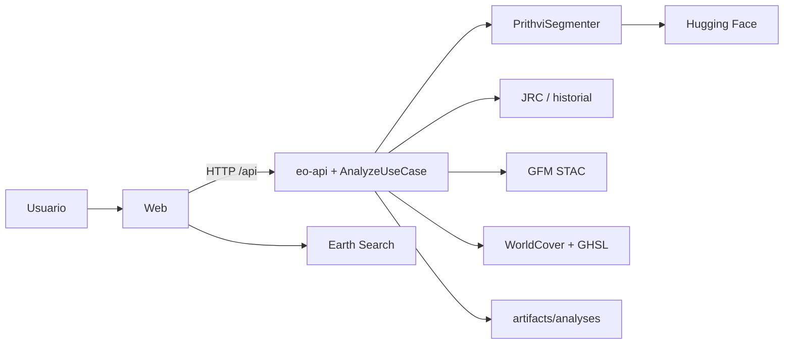
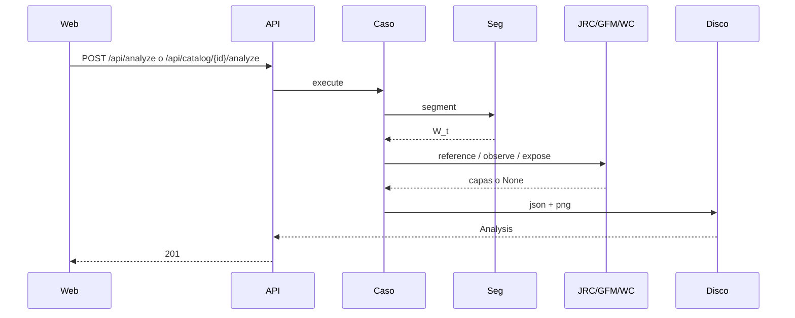
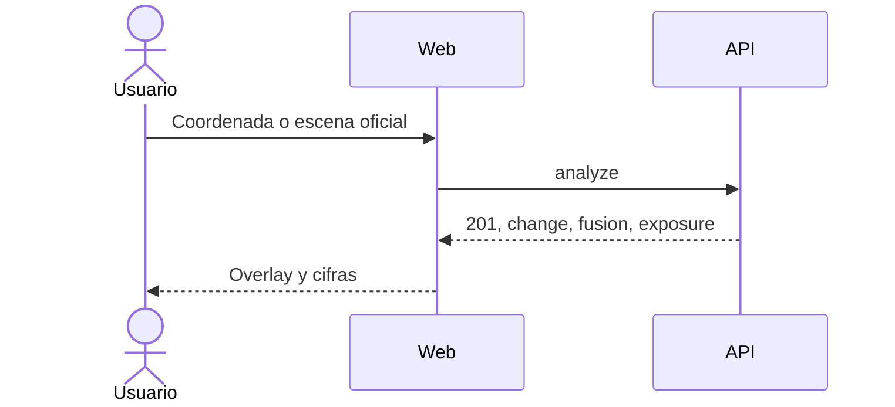
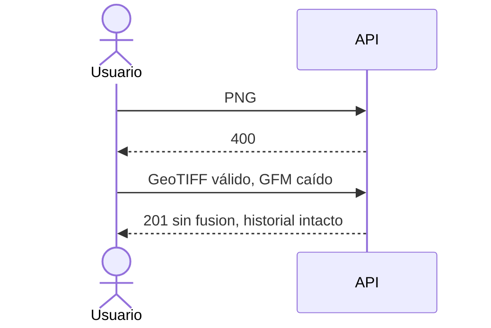

# Tune: análisis satelital de inundación como cambio hídrico, con Prithvi-EO 2.0

**Autores:** Carlos Andrés Galvis Pájaro y Zenen Contreras Royero
**Tutor:** Daniel Romero
**Segundo informe** · octubre de 2026 · repositorio [tune](https://github.com/Charlsz/Tune)

Este documento describe la solución **vigente**. El [Primer Informe](./PrimerInforme.md) queda como planteamiento original (congelado el 2026-08-29). Cada ajuste de alcance se justifica aquí, no se narra como bitácora.

## Resumen / Abstract

El problema que Tune resuelve no es “correr un modelo de visión”. Es convertir un GeoTIFF (o una escena Sentinel-2 buscada por coordenada) en un análisis **recuperable** de inundación o de cicatriz de incendio, con una definición operativa que no confunde el cauce con el desborde. El checkpoint publicado `Prithvi-EO-2.0-300M-TL-Sen1Floods11` clasifica agua, no inundación. Sin una referencia de agua permanente, un río en época seca sale como “inundado”. Esa crítica, hecha en tutoría, es el eje de la solución actual.

La solución vigente es una aplicación cliente-servidor (FastAPI + React) que ejecuta dos checkpoints IBM-NASA ya fine-tuneados, calcula \(F_t = W_t \land \lnot P\) frente a JRC Global Surface Water o al historial del mismo territorio, compara la máscara con Copernicus GFM cuando el producto responde, y traduce el agua nueva a cobertura ESA WorldCover y población GHSL. El usuario no está atado a un país: el catálogo STAC y las capas de referencia son globales. El pronóstico hidrológico se retiró porque no usa el modelo y el profesor lo excluyó del alcance defendible.

El estado del desarrollo es un prototipo de extremo a extremo: 139 pruebas automáticas sin GPU ni red, API documentada, web con catálogo y bloque “frente a referencia”, persistencia compatible con `analysis.json` antiguos. Lo que falta hacia la entrega es una corrida documentada con pesos reales (`make validate-sites`) que llene IoU, `new_km2` y población en al menos dos sitios, y el informe final. El laboratorio de fine-tuning (`lab/`) permanece como anexo: no es el núcleo ni el argumento de este avance.

## 1. Introducción

El desarrollo de foundation models geoespaciales desplazó parte del trabajo práctico desde el preentrenamiento hacia el **uso** de pesos ya especializados. Prithvi-EO 2.0, TerraTorch y los repositorios Hugging Face de IBM-NASA dejan dos checkpoints listos para inundación (Sen1Floods11) y cicatriz (HLS Burn Scars). En un proyecto de grado, el hueco no es “inventar un detector”: es un sistema que reciba un raster, respete el procedimiento oficial de inferencia y deje un resultado que se pueda abrir, citar y repetir.

Ese hueco se malinterpreta con facilidad. Un script de `inference.py` produce una máscara y se detiene. Un laboratorio MLOps que compara estrategias de entrenamiento produce una tabla de mIoU si las corridas terminan, y no produce un análisis servido si la GPU no arranca. El planteamiento inicial de este proyecto era precisamente ese laboratorio. El tutor pidió comprometer tarea, dataset, modelo y criterios verificables, y más adelante señaló que “usar Prithvi” no basta si el producto llama inundación a todo el agua. Ambas observaciones se incorporan aquí como alcance vigente, no como relato del trabajo anterior.

Tune, en su estado actual, es el sistema que responde a esas dos exigencias. Compromete dos tareas, dos datasets de procedencia y dos modelos publicados. Define inundación como agua nueva frente a una referencia global. Permite buscar cualquier coordenada. Compara, cuando hay dato, con un producto operativo (GFM). El impacto esperado es un flujo comprobable: escena válida entra; análisis con `model_id`, `change`, y si aplica `fusion` y `exposure`, sale. El estado del trabajo es ese flujo cableado y cubierto por pruebas; la evidencia de inferencia real es el hito de cierre.

## 2. Marco conceptual

Este apartado fija el vocabulario con el que se leen el problema, la solución y las decisiones técnicas. Sin él, “inundación”, “checkpoint” y “referencia” se confunden.

### 2.1 Raster, bandas Prithvi y segmentación

Una imagen operativa no es un JPG. Es un raster georreferenciado: bandas espectrales, CRS y una transformación afín. Prithvi-EO 2.0 espera **seis** bandas (BLUE, GREEN, RED, NIR_NARROW, SWIR_1, SWIR_2). Tune acepta un GeoTIFF de esas seis o, en inundación, un Sentinel-2 L1C del que extrae los índices correspondientes. Un RGB de tres canales se rechaza.

La segmentación semántica asigna una clase a cada píxel. El checkpoint de inundación distingue “sin agua” y “agua”. El de cicatriz, “no quemado” y “cicatriz”. El área en km² se obtiene del tamaño de píxel por el recuento de la clase positiva, excluyendo nodata. Sin CRS hay máscara y no hay ubicación.

Tres consecuencias de diseño siguen de aquí. Tune no detecta inundación en cualquier fotografía. El porcentaje “afectado” del modelo es agua (o cicatriz) detectada, no inundación. El visor es un overlay de esa máscara, no un GIS de propósito general.

### 2.2 Foundation model, checkpoint y procedimiento oficial

Un foundation model geoespacial aprende representaciones sobre series HLS y se especializa después. Un **checkpoint** es el par pesos + `config.yaml`. Tune consume, sin reentrenar:

| Tarea | Dataset de procedencia | Repositorio Hugging Face |
|---|---|---|
| `flood` | Sen1Floods11 (vía óptica Sentinel-2) | `ibm-nasa-geospatial/Prithvi-EO-2.0-300M-TL-Sen1Floods11` |
| `burn_scar` | HLS Burn Scars | `ibm-nasa-geospatial/Prithvi-EO-2.0-300M-BurnScars` |

La inferencia oficial recorta ventanas 512×512 y recompone la máscara. Tune porta esa lógica con TerraTorch (`LightningInferenceModel.from_config`). El `model_id` viaja en cada análisis. Entrenar Prithvi-300M es un experimento de adaptación; inferir con el checkpoint publicado es un problema de ingeniería. Este informe se sitúa en lo segundo. El `lab/` queda para quien quiera comparar estrategias; no es condición de la demo.

### 2.3 Cambio hídrico, fusión y exposición

El checkpoint detecta \(W_t\). Inundación se define \(F_t = W_t \land \lnot P\), con \(P\) el agua permanente (JRC occurrence ≥ 75 % o historial del territorio). Cicatriz nueva es \(B_t \land \lnot B_{ref}\). Esa definición no es original (GFM y UN-SPIDER la usan); lo que Tune aporta es aplicarla al checkpoint fundacional y servirla.

La **fusión** compara \(W_t\) de Tune con una capa operativa (GFM ensemble, opcionalmente OPERA DSWx) alineada a la misma grilla. El IoU y los residuales (solo Tune, solo externo, sin dato) son la métrica de acuerdo, no una afirmación de que Tune “gane” a GFM. La **exposición** cruza el agua nueva con ESA WorldCover 2021 y población GHSL 2020. El usuario de gestión de riesgo no consume “12 % de píxeles”; consume km² de cultivo y personas.

La arquitectura hexagonal (puertos `HazardSegmenter`, `ReferenceProvider`, `ObservationProvider`, `ExposureProvider`, `SceneCatalog`) mantiene el dominio libre de numpy, torch y rasterio. Un proveedor que falle no tumba el análisis: se guarda sin `change`, sin `fusion` o sin `exposure`.

## 3. Planteamiento del problema

### 3.1 Descripción del problema

Producir un mapa de inundación a partir de una escena satelital exige coordinar raster, modelo, georreferencia y un modo de consultar el resultado. En un equipo académico ese proceso se parte: o se invierte el semestre en fine-tuning y no hay producto, o se corre un script una vez y queda un archivo en disco. El planteamiento inicial de Tune era el primer camino (laboratorio MLOps, baseline vs optimizado, promoción de modelo). Ese camino no entrega un análisis usable si la corrida no cierra, y no responde a la crítica de que el detector publicado ve agua.

Las causas son tres. Primera, el costo de reentrenar 300 M de parámetros empuja a “cuando la GPU termine”. Segunda, las herramientas cubren fragmentos (TerraTorch infiere, Hugging Face aloja, un GIS dibuja) y no unen validar, inferir, restar permanente, comparar con un producto operativo y persistir. Tercera, llamar “inundación” a \(W_t\) produce un falso positivo sistemático en ríos y ciénagas; el usuario no técnico no puede distinguir cauce de desborde.

La población afectada son estudiantes, ingenieros y, en la demo, un tutor o un analista que necesita un resultado demostrable **sin** plataforma enterprise y **sin** semanas de GPU. El estado negativo es: el modelo existe, el dataset existe, y aun así no hay un análisis que se pueda defender como inundación ni recuperar mañana.

> **Disponer de un foundation model y de un dataset de inundación no produce, por sí solo, un análisis de inundación. Quienes reentrenan quedan expuestos a corridas que no cierran. Quienes solo infieren quedan con agua etiquetada como inundación. Falta un sistema que, con checkpoints publicados y una referencia global, transforme una escena de cualquier coordenada en agua nueva, acuerdo externo y exposición, recuperables por API.**

### 3.2 Justificación

Atender este problema es pertinente porque los checkpoints **ya existen**. La carencia es el flujo que valida la entrada, ejecuta el procedimiento oficial, resta \(P\), compara con GFM cuando hay dato y deja artefactos. Usar el peso publicado y mostrar `new_km2` e IoU es evidencia que se abre en un navegador y se repite con Docker.

Es pertinente en Ingeniería de Sistemas porque el aporte no es Prithvi ni GFM. El aporte es el contrato (bandas, tareas, referencia, fusión, exposición) y la arquitectura que los sirve. Sin ese sistema, el modelo publicado sigue siendo un comando. Lo que se evalúa es que el prototipo respete el contrato y que los objetivos se puedan verificar con las métricas declaradas en la sección 4.

Es defendible en este ciclo porque el objetivo verificable es concreto: un GeoTIFF o una escena STAC válida produce un análisis con `model_id`; si hay referencia, `change.new_area_km2` es la cifra de inundación; si hay GFM, `fusion.iou` queda registrado; una entrada inválida se rechaza. No se exige un mIoU nuevo del detector. La calidad de \(W_t\) es la que IBM-NASA publicó; lo que se valida es el sistema y la definición operativa.

### 3.3 Restricciones y supuestos de diseño

El proyecto es un prototipo académico. No hay autenticación, cola ni SLA. Los pesos se descargan de Hugging Face en la primera inferencia (~1,2 GB) y se cachean. Sin red en esa primera corrida no hay inferencia. La entrada válida es GeoTIFF de seis bandas, L1C amplio en inundación, o una escena L2A del catálogo Earth Search. CPU basta para demostrar; GPU acelera. Un análisis a la vez.

Se asume que JRC GSW v1.4 y WorldCover 2021 cubren el bbox pedido (son globales). GFM cubre tierra no polar con Sentinel-1; si no hay ítem en la ventana temporal, `fusion` queda vacío y el análisis se guarda igual. OPERA DSWx exige token Earthdata y está apagado por defecto. L2A (BOA) no es L1C (TOA): hay un sesgo sistemático que se declara, no se oculta. PostGIS, profundidad (FwDET + DEM) y pronóstico quedan fuera.

Esas restricciones fijan lo que el jurado puede comprobar. La entrada es un raster de contrato. La salida es máscara, `change` si hay \(P\), `fusion` si hay capa externa, `exposure` si WorldCover responde. El modelo no se entrena en la demo.

### 3.4 Alcance actualizado

El planteamiento inicial (laboratorio que compara N estrategias de entrenamiento y promueve un alias) **se sustituye** como núcleo. El tutor pidió comprometer tarea, dataset, modelo y umbrales verificables; más adelante, que el informe reflejara el último cambio de solución y que el producto no se defendiera como “usar Prithvi”. El alcance vigente es la **aplicación de análisis** con definición de cambio, no el laboratorio. El `lab/` permanece en el repositorio y no se evalúa en este informe.

**Incluye.** Ingesta GeoTIFF (≤ 200 MB) o escena Sentinel-2 L2A por coordenada. Tareas `flood` y `burn_scar` con los dos checkpoints nombrados. Inferencia oficial 512×512. Inundación como \(W_t \land \lnot P\) (JRC u historial). Serie, diff y sectores del territorio. Fusión con GFM (OPERA opcional). Exposición WorldCover + GHSL. API, CLI, web, Docker. Pruebas sin red ni GPU. Validación multi-sitio (`make validate-sites`), no un territorio exclusivo.

**No incluye.** Fine-tuning como entregable principal. Pronóstico (retirado; ADR 013). Profundidad del agua. PostGIS, login, colas, Kubernetes. Un piloto anclado a La Mojana como único caso: ese sitio es *un* control en `sitios.yaml`, no el producto.

**Usuarios.** El equipo opera. El tutor o el jurado abre la web, elige una coordenada o una escena oficial, y lee máscara, agua nueva y, si hay dato, acuerdo y exposición.

**Resultado esperado.** Prototipo: dos tareas, cambio hídrico global, fusión opcional, exposición, controles multi-sitio con pasó/no pasó.

## 4. Objetivos

Los objetivos se redactan como resultados experimentales reproducibles, con tarea, dataset, modelo y umbrales. No son una lista de “implementar módulos”.

### 4.1 Objetivo general

**Ejecutar, sobre un GeoTIFF válido o una escena Sentinel-2 L2A de cualquier coordenada, el checkpoint publicado de la tarea elegida; persistir el análisis con el `model_id` de ese checkpoint; calcular inundación como agua nueva frente a JRC o historial cuando la referencia exista; registrar el acuerdo con GFM cuando el producto responda; y servir máscara, `change`, `fusion` y `exposure` por la API comprometida.**

Compromiso concreto:

| Pieza | Valor |
|---|---|
| Tareas | `flood`, `burn_scar` |
| Datasets de procedencia | Sen1Floods11, HLS Burn Scars (pesos; no se versionan en Git) |
| Modelos | `ibm-nasa-geospatial/Prithvi-EO-2.0-300M-TL-Sen1Floods11`, `...-BurnScars` |
| Estrategias de **interpretación** (N = 3) | S1 agua cruda \(W_t\); S2 cambio \(W_t \land \lnot P\); S3 fusión Tune vs GFM |
| Criterio de calidad (S2) | en escena con cauce visible (`spain`): `persistent_km2 > 0` y `new_km2 < affected_km2` |
| Criterio de calidad (S2, río en seca) | `new_km2 / affected_km2 < 0.15` cuando hay fecha seca |
| Criterio de calidad (S3) | `fusion.iou` se registra si GFM responde; no se exige umbral mínimo a priori (se reporta) |
| Criterio de eficiencia | un análisis a la vez; demo en CPU; primera descarga de pesos cacheada |
| Promoción | no hay alias MLflow en la demo; se “promueve” la cifra `new_km2` (S2) sobre `affected_km2` (S1) como la que se defiende |

El objetivo se cumple cuando `pytest -m "not gpu"` pasa, cuando `POST /api/analyze` persiste `model_id`, cuando un `analysis.json` viejo carga, y cuando `make validate-sites` deja pasó/no pasó de los controles de la tabla. No se cumple por tener más UI.

### 4.2 Objetivos específicos

1. **Contrato de entrada y salida.** Seis bandas Prithvi (o L1C / L2A del catálogo); salida con máscara, bounds, `model_id`, `change` opcional, `fusion` opcional, `exposure` opcional.
2. **Integrar** los dos checkpoints mediante TerraTorch, sin reentrenar, con el procedimiento de ventana 512×512.
3. **Calcular S2** (`compare`) sobre la misma grilla; persistir `change.png` y `reference.tif`; no tumbar el análisis si la referencia falla.
4. **Calcular S3** (`fuse`) contra GFM cuando el STAC de EODC devuelva un ítem; persistir `fusion.png`.
5. **Exponer** agua nueva sobre WorldCover y GHSL; no tumbar el análisis si el tile no responde.
6. **Servir** el mismo caso de uso por API, CLI y web, con catálogo `GET /api/catalog/search` y `POST /api/catalog/{id}/analyze`.
7. **Validar** con pruebas unitarias e integración (fakes, sin red) y con el protocolo multi-sitio sobre la API real.

Enunciado verificable:

> Bajo las mismas condiciones (mismo GeoTIFF o misma escena STAC, mismo dispositivo), registrar S1 (`affected_km2`), S2 (`new_km2`, `persistent_km2`) y S3 (`fusion.iou` si hay GFM); defender como inundación únicamente S2; rechazar archivos que no sean GeoTIFF y tareas desconocidas.

## 5. Estado del arte / soluciones relacionadas

### 5.1 Fuentes de referencia

El corpus es corto a propósito: las fuentes sin las cuales no se puede nombrar modelo, dataset ni producto operativo. Prithvi-EO 2.0 (Szwarcman et al., 2024) y los dos repositorios Hugging Face fijan el detector. Sen1Floods11 (Bonafilia et al., 2020) y HLS Burn Scars (Phillips et al., 2023) son la procedencia de los pesos. JRC GSW (Pekel et al., 2016) es \(P\). Copernicus GFM (Wagner et al., 2026; PUM 4.0) es la capa de acuerdo. ESA WorldCover 2021 y GHSL 2020 son exposición. UN-SPIDER documenta el cruce de extensión con población y cultivos.

Ese corpus alcanza para posicionar Tune. No se revisa aquí el mercado de seguros (Floodbase, ICEYE) más que para marcar el techo: Tune no compite en latencia global ni en profundidad a nivel de edificio.

La lectura de esas fuentes fija una distinción que el primer informe no tenía: **detectar agua**, **mapear inundación** y **pronosticar caudal** son tres problemas. Tune hace los dos primeros. El tercero se retiró.

### 5.2 Productos operativos y herramientas abiertas

Copernicus GFM procesa Sentinel-1 con un ensamble (LIST, DLR, TU Wien), entrega extensión, agua de referencia, verosimilitud y exclusión, con latencia típica menor a ocho horas y archivo desde 2015. NASA OPERA DSWx produce agua superficial a 30 m (HLS y S1). Google Flood Hub pronostica caudal e inundación fluvial (y, en 2026, flash floods urbanos, con cobertura en Colombia). MapBiomas Agua mapea permanente vs estacional a escala nacional. HydraFloods y la práctica UN-SPIDER en Earth Engine hacen cambio SAR + exposición. FwDET estima profundidad a partir de extensión y DEM.

UNGRD, en emergencias del Caribe colombiano, activa International Charter y Copernicus EMS: consume productos, no reentrena un foundation model. IDEAM opera FEWS y pronóstico hidrológico. Esos son el usuario institucional real.

Frente a ese mapa, Tune no es un sustituto de GFM ni de Flood Hub. Es un prototipo que **usa** un foundation model óptico, **resta** permanente, **compara** con GFM cuando hay dato y **traduce** a exposición, en cualquier coordenada, con un contrato auditable.

### 5.3 Posicionamiento

Tune no gana en cobertura, ni en nubes (óptico vs SAR), ni en latencia operativa. El diferencial defendible es de ingeniería y de interpretación: el mismo checkpoint que un notebook pinta como “inundación” aquí se sirve como \(W_t\), se corrige con \(P\), se confronta con un producto de radar y se agrega por clase de suelo. Eso es lo que un jurado puede abrir en `:8080` sin cuenta Earth Engine.

El laboratorio MLOps del primer informe se posiciona ahora como **fuera del núcleo**. Comparar LoRA contra full fine-tune es un experimento válido; no es lo que este avance entrega ni lo que el tutor pidió priorizar una vez existió el producto de inferencia.

La frase de tesis de este informe, por tanto, no es “aplicación que usa Prithvi”. Es: evaluación servible de un checkpoint fundacional como detector de agua, con definición de cambio, fusión opcional con GFM y exposición global.

## 6. Solución propuesta

Tune es una aplicación de análisis satelital. Recibe un GeoTIFF o una escena L2A del catálogo Earth Search, una tarea, y ejecuta el checkpoint publicado. Devuelve máscara, estadísticas, agua nueva frente a referencia, acuerdo con GFM si hay capa, y exposición. Los usuarios de la demo son el equipo y el tutor. No hay roles.

El enfoque es **consumir especialización publicada e interpretarla**. IBM-NASA fine-tuneó; Tune descarga, infiere y persiste. JRC y el historial dan \(P\). GFM da una segunda opinión SAR. WorldCover y GHSL dan el “y qué”. La propuesta de valor: el operador elige un punto en cualquier continente, analiza, y lee km² nuevos y, si hay dato, IoU y población, sin fine-tuning y sin pronóstico.

El flujo es:

```text
GeoTIFF o escena STAC + tarea
  → validación / 6 bandas
  → Prithvi (512×512) → W_t
  → P (JRC u historial) → change
  → GFM (si hay ítem) → fusion
  → WorldCover + GHSL → exposure
  → artifacts/analyses/<id>/
  → API / CLI / web
```

La experiencia demostrable es abrir `:8080`, analizar `spain` o buscar un lat/lon, ver overlay, bloque “frente a referencia”, y si GFM respondió, IoU. Verificar el éxito es leer `model_id`, `change.new_area_km2` y el rechazo de un PNG.

## 7. Metodología de desarrollo

Se adoptó prototipado iterativo porque el sistema mezcla raster, modelo, API e interfaz. Cada ciclo deja un contrato o una frontera (puerto, test, ADR) y se ajusta cuando el código o la tutoría contradicen el plan.

Las iteraciones del semestre, en el orden que el jurado puede ver en git, son: (1) laboratorio MLOps y arquitectura hexagonal; (2) pivote a aplicación de inferencia con checkpoints publicados (ADR 005), tras el pedido de comprometer tarea/dataset/modelo; (3) metadatos, timeline y búsqueda por coordenada; (4) pronóstico Open-Meteo (ADR 009), luego retirado (ADR 013) porque el profesor lo excluyó y no usa Prithvi; (5) definición \(F = W \land \lnot P\), JRC, historial, serie y sectores (ADR 010, 012); (6) catálogo STAC (ADR 011); (7) fusión GFM y exposición global, y validación multi-sitio en lugar de un piloto único (ADR 014, 015).

La validación de cada ciclo combina pytest en CI (sin GPU, sin red: fakes y monkeypatch) y revisión del flujo en la interfaz. Los hallazgos que cambiaron el diseño fueron: el checkpoint ve agua; affine 3 rompe al iterar; WorldPop mosaico no admite HTTP Range (se eligió GHSL); OPERA exige token (queda opt-in). La regla de prioridad es: primero un análisis defendible en cualquier coordenada; después pulido; nunca reabrir pronóstico ni anclar el producto a un municipio.

## 8. Requerimientos

### 8.1 Funcionales

RF1. El sistema lista `flood` y `burn_scar` con el `repo_id` Hugging Face. RF2. Acepta GeoTIFF + tarea o una escena del catálogo (`lat`, `lon`, fechas) y persiste un análisis con id único. RF3. El análisis incluye válidos, afectados, razón, km², CRS, bounds, latencia y `model_id`. RF4. Si hay referencia, incluye `change` (nuevo, persistente, retirado) y artefactos `change.png` / `reference.tif`. RF5. Si GFM (u OPERA) responde, incluye `fusion` y `fusion.png`. RF6. Si WorldCover responde, incluye `exposure` (clases y población si GHSL responde). RF7. Historial, timeline, serie, diff y sectores. RF8. Rechazo explícito: no GeoTIFF (400), tarea desconocida (422), > 200 MB (413), modelo no cargado (503). RF9. CLI `tune analyze` comparte el caso de uso. RF10. La web muestra overlay, cifras de cambio, acuerdo y exposición cuando existen.

Esos requerimientos son comprobables sin leer el código. El rechazo es comportamiento, no anexo. La interfaz no inventa coordenadas si no hay CRS ni IoU si GFM no respondió.

### 8.2 No funcionales

RNF1. Reproducibilidad: `make app-up` levanta API y web; pesos en `hf-cache`. RNF2. Portabilidad: demo en CPU. RNF3. Mantenibilidad: el dominio no importa torch ni rasterio; proveedores perezosos. RNF4. Claridad de fallo: 422/503 explícitos; un proveedor caído no borra el análisis. RNF5. Desempeño de demo: un análisis a la vez; no hay throughput comprometido. RNF6. Seguridad: prototipo local, sin auth. RNF7. Compatibilidad: `analysis.json` sin `change`/`fusion`/`exposure` carga con null. RNF8. Tests: `pytest -m "not gpu"` sin red.

Reproducibilidad y portabilidad fijan la entrega. Mantenibilidad se verifica porque CI inyecta `FakeSegmenter`, `FakeCatalog` y capas sintéticas. Desempeño y seguridad se declaran al tamaño de la demo.

## 9. Evaluación de alternativas

Las alternativas reales, bajo la carga de una demo (un operador, un análisis), son cuatro. Los criterios del template (latencia, acoplamiento, fallos) se aplican a esa carga, no a un millar de usuarios.

### 9.1 Alternativas consideradas

A1. Fine-tuning propio como núcleo (baseline vs N estrategias, promoción de alias). Cumple el enunciado original del laboratorio. No entrega análisis si la corrida no cierra. A2. Cambiar solo el dataset y seguir entrenando. Mejora pertinencia; no quita la GPU. A3. Clasificador pequeño en CPU. Rápido; no es geoespacial. A4. Checkpoints publicados + aplicación de cambio, fusión y exposición (seleccionada). Compromete tarea, dataset y modelo. CPU. Cifras defendibles: `new_km2`, IoU, población.

### 9.2 ¿Cuál alternativa ofrece mejor desempeño bajo la carga esperada?

La carga es un `POST /api/analyze`. A1 y A2 no sirven inferencia si no entrenaron. A3 sirve otro problema. A4 tiene latencia dominada por la primera descarga de pesos y por las ventanas 512×512; JRC/GFM/WorldCover leen ventanas, no tiles completos. Concurrencia: un análisis a la vez, modelo cacheado en proceso. El criterio que importa es **tiempo hasta un análisis visible con `change`**, no peticiones por segundo.

| Criterio (demo) | A1 Train | A3 CPU classif. | A4 App + checkpoints |
|---|---|---|---|
| Tiempo a resultado visible | Días / bloqueable | Horas, otra tarea | Minutos tras caché |
| Latencia de una inferencia | N/A | Baja | Media en CPU |
| Throughput concurrente | No aplica | Alto e irrelevante | Uno a la vez (aceptado) |

### 9.3 ¿Qué grado de acoplamiento introduce cada opción?

A4 depende de Hugging Face, TerraTorch, JRC (GCS), Earth Search, GFM (EODC) y, si se enciende, Earthdata. Cada dependencia está detrás de un puerto; un 503 o un `None` no tumba el resto. El acoplamiento interno es bajo: `FakeSegmenter` y `FakeCatalog` sustituyen en tests. A1 acopla al hardware de entrenamiento. A3 desacopla el dominio satelital y lo abandona. Sustituir el frontend o el repositorio en disco no exige tocar Prithvi. Sustituir Prithvi exige el puerto y las seis bandas.

### 9.4 ¿Qué nivel de disponibilidad y tolerancia a fallos ofrece cada alternativa?

Ninguna es un servicio con uptime. En A4, si Hugging Face no responde en la primera corrida no hay inferencia y el historial previo sigue. Si JRC o GFM fallan, el análisis se guarda sin `change` o sin `fusion`. Si WorldCover falla, sin `exposure`. Bandas incorrectas: 422. No hay réplicas; hay carpetas en `artifacts/`. En A1, un OOM deja cero producto. Se elige A4 porque es la única que, en el calendario, produce un análisis verificable con las tres estrategias de interpretación (S1–S3) y con fallo parcial acotado.

## 10. Diseño y arquitectura

### 10.1 Descripción general de la arquitectura

Tune es cliente-servidor en dos contenedores: nginx sirve el build de Vite (8080) y FastAPI (`eo-api`, 8000) orquesta `AnalyzeUseCase`. No es BaaS. La inferencia corre en el mismo proceso (sin cola), coherente con A4 y con un análisis a la vez.

El enfoque es hexagonal: las dependencias apuntan al dominio. TerraTorch, rasterio, pystac-client y `/vsicurl/` viven en infraestructura. La alternativa A4 se materializa en `PrithviSegmenter`, `JrcReferenceProvider`, `StacObservationProvider` y `RasterExposureProvider`. El resto no conoce nombres de archivo `.pt` ni URLs de tiles.

### 10.2 Componentes del sistema

| Componente | Responsabilidad | Requerimientos |
|---|---|---|
| `web/` | Carga, catálogo, visor, stats, historial | RF2, RF7, RF10 |
| `eo-api` | HTTP, validación | RF1–RF8 |
| `AnalyzeUseCase` | Segmentar → change → fusion → exposure → persistir | RF2–RF6, RF9 |
| `PrithviSegmenter` | Pesos HF + ventana 512×512 | RF2, obj. 2 |
| `ReferenceProvider` | JRC / historial | RF4 |
| `ObservationProvider` | GFM / OPERA | RF5 |
| `ExposureProvider` | WorldCover + GHSL | RF6 |
| `SceneCatalog` | Earth Search L2A | RF2 |
| `FileAnalysisRepository` | `artifacts/analyses/<id>/` | RF3, RF7, RNF7 |
| Volumen `hf-cache` | Pesos | RNF1 |
| CLI Typer | Mismo caso de uso | RF9 |

**Figura 1. Arquitectura de Tune.**



### 10.3 Interacción entre módulos

El navegador no habla con TerraTorch. Llama `/api`. El router valida, escribe un temporal o pide al catálogo las seis bandas, y llama al caso de uso. El segmentador infiere. El caso de uso pide referencia, observación y exposición **después** de tener máscara; cada una puede devolver `None`. El repositorio escribe JSON y PNG. Las descargas posteriores son archivos.

Las dependencias van de interfaz a aplicación a dominio. Infraestructura implementa puertos. El acoplamiento entre tareas es un diccionario de fichas: inundación y cicatriz comparten el camino; JRC y GFM solo aplican a `flood`.

**Figura 2. Interacción entre módulos.**



### 10.4 Comportamiento

La secuencia feliz es corta: elegir tarea y escena, inferir, restar \(P\), fusionar si hay GFM, exponer, guardar, pintar. El cuello es la inferencia (y la primera descarga). Las lecturas remotas son ventanas, no tiles de 70 MB enteros. El desacoplamiento se verifica en CI: la API se prueba con segmentador falso; fusión y exposición se prueban con arrays sintéticos.

Los fallos no tumban el historial. PNG → 400. Bandas → 422. Modelo → 503. GFM caído → análisis sin `fusion`. JSON viejo → `fusion` y `exposure` en null.

**Figura 3. Análisis válido.**



**Figura 4. Rechazo y fallo parcial.**



## 11. Implementación y avance actual

### 11.1 Stack tecnológico

Backend en Python 3.11: FastAPI, Typer, TerraTorch/PyTorch (extra `training`), rasterio, pystac-client, NumPy, Pillow. Frontend TypeScript, React 19, Vite. Compose: `eo-api` + `web`. Pruebas: pytest, ruff. No hay PostgreSQL: el historial es una carpeta por análisis. Hugging Face, JRC GCS, Earth Search, EODC STAC, WorldCover S3 y GHSL JRC son las fuentes externas, todas leídas por ventana o por API de búsqueda.

La elección cierra con A4. No hay segundo lenguaje de servidor ni base espacial.

### 11.2 Componentes implementados

Dominio: `HazardTask`, `Analysis`, `ChangeSummary`, `FusionSummary`, `ExposureSummary`, `RasterGrid`, puertos. Aplicación: `AnalyzeUseCase`, `compare`, `fuse`, `expose`, `series`, `sectors`. Infraestructura: `PrithviSegmenter`, `FileAnalysisRepository`, JRC, historial, composite, `StacCatalog`, `StacObservationProvider` (presets GFM y OPERA), WorldCover, GHSL, contenedor. API: tareas, ejemplos, analyze, catálogo, timeline, serie, diff, sectores, artefactos (incluye `fusion_png`). Web: carga, catálogo, visor, StatsCard con cambio/fusión/exposición, historial. Docker CPU/port GPU.

El estado es funcional en el repositorio. El flujo se ejerce de extremo a extremo una vez cacheados los pesos. `pytest -m "not gpu"`: 139 passed.

### 11.3 Integraciones realizadas

Hugging Face (config + pesos, `HF_HOME`). Earth Search v1 (búsqueda y recorte L2A, offset BOA desde 2022-01-25, SCL → nodata). JRC GSW occurrence por `/vsicurl/` y caché de recorte. GFM STAC EODC (`ensemble_flood_extent`). WorldCover 2021 tiles 3°. GHSL POP 2020 tiles 10° en zip (WorldPop mosaico se descartó: no admite Range). OPERA STAC se cableó y se deja opt-in por token. No hay login ni Copernicus EMS on-demand.

### 11.4 Pendientes para la entrega final

Corrida `make validate-sites` con pesos reales y tabla pasó/no pasó llena (IoU, ratios, población). Capturas de usabilidad. Informe final. Fine-tune de dominio y profundidad (FwDET) quedan explícitamente fuera de este cierre. Una escena local solo si cumple bandas y CRS, después de la corrida multi-sitio.

## 12. Despliegue y operación preliminar

El entorno de demo es Docker Compose en una máquina con Docker y RAM suficiente. No hay hosting de pago.

```bash
cp .env.example .env
make app-up
make validate-sites
make app-down
```

API en `http://localhost:8000/docs`. Volumen `hf-cache` para pesos. Análisis en `artifacts/analyses/`. Variables: `TUNE_REFERENCE_JRC`, `TUNE_JRC_PERMANENT_PCT`, `TUNE_CATALOG_MAX_KM`, `TUNE_OBSERVE_GFM`, `TUNE_OBSERVE_OPERA`, `EARTHDATA_TOKEN`, `TUNE_EXPOSURE`. Detalle en [Instalación.md](./Instalación.md). Esto no es producción 24/7.

## 13. Validación preliminar

### 13.1 Pruebas por componentes

`test_analyze.py`, `test_change.py`, `test_fusion.py`, `test_exposure.py` cubren conteos e IoU con arrays sintéticos. `test_jrc_reference.py`, `test_history_reference.py`, `test_stac_catalog.py`, `test_observation.py`, `test_worldcover_population.py` cubren proveedores con monkeypatch (sin red). `test_grid.py` usa GeoTIFF sintéticos locales. CI: `pytest -m "not gpu"`.

### 13.2 Pruebas de integración

`test_api_analyses.py` verifica tareas, análisis, artefactos, catálogo con `FakeCatalog`, rechazo de entradas inválidas. El segmentador real no se carga. OpenAPI lista cada ruta con summary y description.

### 13.3 Pruebas de usabilidad

Guion: abrir la web, analizar `spain` o buscar un lat/lon, ver máscara, agua nueva, y si hay fusión, IoU. Usuarios: equipo y tutor. Aún no hay pasada registrada con capturas; esa evidencia es del plan de cierre. El diseño es una sola pantalla, sin login.

Los controles de coherencia (río en seca, cauce `spain`, evento con `new_km2 > 0`) viven en [validation/sitios.md](./validation/sitios.md). La Mojana no es el alcance: es un renglón opcional de ese YAML.

## 14. Resultados parciales y discusión

El hallazgo principal no es un mIoU nuevo. Es que el sistema **ya expresa** las tres estrategias de interpretación (S1 agua, S2 cambio, S3 fusión) y la exposición, con compatibilidad hacia atrás y 139 pruebas verdes. Frente a los objetivos específicos, 1–6 están implementados en código; el 7 (corrida real multi-sitio) es el trabajo inmediato.

La interpretación es que el pivote desde el laboratorio MLOps hacia la aplicación de cambio está justificado: cumple el pedido de comprometer tarea, dataset y modelo, y responde a la crítica de que Tune “solo usa Prithvi” y llama inundación al río. El riesgo que queda es operativo (nubes en L2A, GFM sin ítem, sesgo TOA/BOA). Se mitiga declarando `fusion.unknown_pixels` y el sesgo L2A en limitaciones, no ocultándolos.

Lo que no se afirma: Tune no sustituye a GFM, no pronostica, no mide profundidad y no está calibrado para un solo humedal. Está construido para cualquier coordenada y se valida con controles, no con una marca de territorio.

## 15. Plan de cierre hacia la entrega final

1. **Corrida `make validate-sites`** con pesos cacheados; llenar pasó/no pasó (spain, un sitio seco, un evento).
2. **Usabilidad evidenciada:** capturas del visor con `change` y, si hay, `fusion`.
3. **Informe final** sobre este texto; no reabrir pronóstico ni fine-tune como núcleo.
4. **Escena local opcional** solo si el GeoTIFF cumple bandas y CRS.

Riesgos: red en la primera descarga; nubosidad; GFM sin cobertura en la ventana; sesgo L2A. Mitigación: pre-cachear; ampliar `window_days`; reportar unknown e IoU tal cual. Criterio de listo: Docker levanta, S2 se defiende como inundación, S3 se registra cuando existe, el YAML de sitios tiene valores, el informe describe esa solución de forma autónoma.

## 16. Referencias

1. Szwarcman, D., Roy, S., Fraccaro, P., et al. (2024). *Prithvi-EO-2.0: A Versatile Multi-Temporal Foundation Model for Earth Observation Applications*. arXiv:2412.02732.
2. IBM-NASA Geospatial. *Prithvi-EO-2.0-300M-TL-Sen1Floods11*. Hugging Face.
3. IBM-NASA Geospatial. *Prithvi-EO-2.0-300M-BurnScars*. Hugging Face.
4. Bonafilia, D., Tellman, B., Anderson, T., & Issenberg, E. (2020). Sen1Floods11. *CVPRW*.
5. Phillips, C., Roy, S., Ankur, K., & Ramachandran, R. (2023). *HLS Foundation Burnscars Dataset*.
6. Pekel, J.-F., Cottam, A., Gorelick, N., & Belward, A. S. (2016). High-resolution mapping of global surface water. *Nature*, 540, 418–422.
7. Wagner, W., et al. (2026). The fully-automatic Sentinel-1 Global Flood Monitoring service. *Remote Sensing of Environment*.
8. Copernicus EMS. *GFM Product User Manual* v4.0 (2025).
9. NASA JPL. OPERA DSWx product suite.
10. Zanaga, D., et al. (2022). ESA WorldCover 10 m 2021 v200.
11. Schiavina, M., et al. (2023). GHS-POP R2023A.
12. UN-SPIDER. Recommended practice: flood mapping with Sentinel-1 in Google Earth Engine.
13. Rojas Sánchez, D. S. (2025). Trabajo de grado, Universidad de los Andes.
14. Sculley, D., et al. (2015). Hidden Technical Debt in Machine Learning Systems. NeurIPS.
15. GitHub. *Tune*. https://github.com/Charlsz/Tune

Decisiones internas: [ADR 005](./decisions/005-app-inferencia-checkpoints-publicados.md), [ADR 010](./decisions/010-inundacion-como-cambio.md), [ADR 011](./decisions/011-catalogo-stac.md), [ADR 013](./decisions/013-retiro-pronostico.md), [ADR 014](./decisions/014-fusion-operativa.md), [ADR 015](./decisions/015-exposicion-global.md), [arquitectura v2](./architecture/v2.md).
