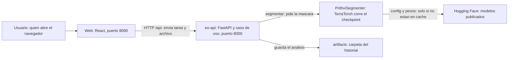
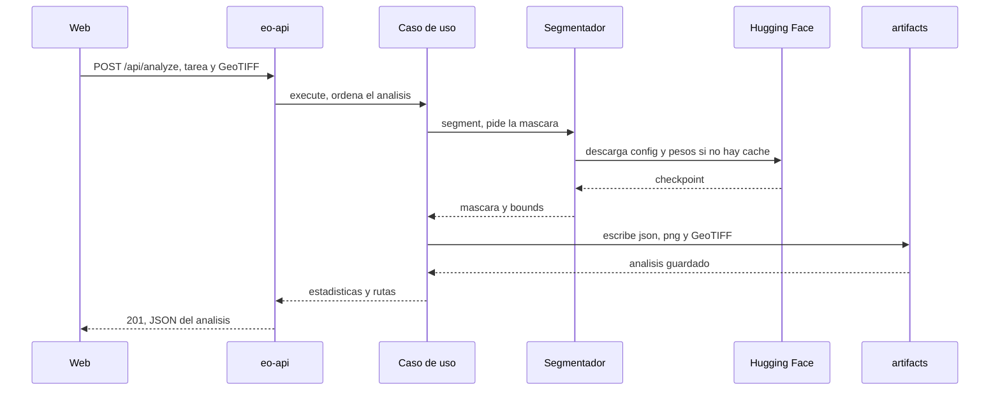
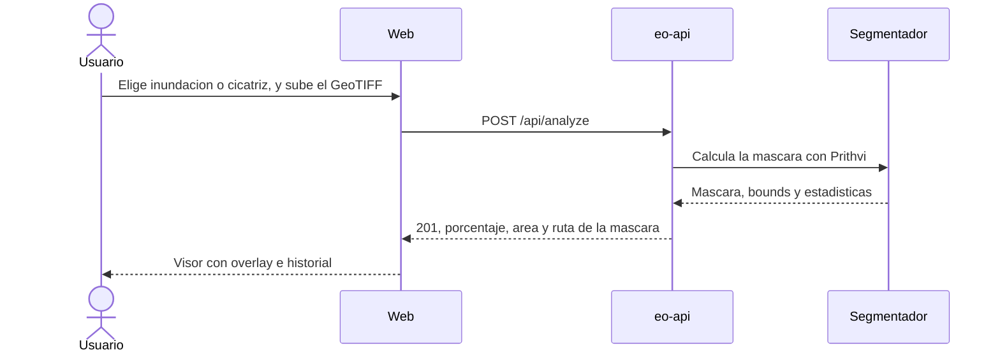
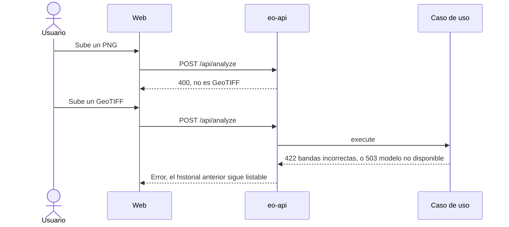

# Tune: aplicación de análisis satelital para inundaciones y cicatrices de incendio con Prithvi-EO 2.0

**Autores:** Carlos Andrés Galvis Pájaro y Zenen Contreras Royero  
**Tutor:** Daniel Romero  
**Avance del segundo informe** · septiembre de 2026 · repositorio [tune](https://github.com/Charlsz/tune)

## Resumen / Abstract

Obtener un análisis de inundación o de cicatriz de incendio a partir de una imagen satelital exige coordinar un raster de varias bandas, una inferencia fiel al procedimiento del modelo, georreferencia cuando existe, y un servicio que deje el resultado recuperable. Existen foundation models geoespaciales y checkpoints ya especializados; lo que suele faltar, a escala de un prototipo académico, es el sistema que convierte esos pesos en un análisis consultable: validación de entrada, máscara, métricas, historial, API y despliegue repetible.

**Tune** es una aplicación de análisis de imágenes satelitales. El usuario elige la tarea (inundación o cicatriz de incendio), carga un GeoTIFF o una escena oficial, y el sistema ejecuta un checkpoint de **Prithvi-EO 2.0** publicado por IBM-NASA en Hugging Face: `Prithvi-EO-2.0-300M-TL-Sen1Floods11` (Sen1Floods11) o `Prithvi-EO-2.0-300M-BurnScars` (HLS Burn Scars). Ambos esperan las mismas seis bandas, de modo que un solo pipeline cubre las dos tareas. La salida es una máscara con porcentaje y área afectada cuando hay tamaño de píxel, historial, API documentada, CLI y despliegue en Docker.

El estado actual es un prototipo funcional: backend FastAPI con TerraTorch, frontend Vite + React, persistencia de artefactos en disco, CLI `tune analyze` y pruebas automáticas de API y de estadísticas de máscara. La primera inferencia descarga los pesos (~1,2 GB) y los cachea; luego corre en CPU y GPU acelera. Quedan pendientes documentar la corrida de cierre con escenas oficiales y el informe final. El aporte del equipo es el contrato de entrada y salida y la arquitectura que sirve el análisis, no un detector nuevo ni una cifra de mIoU propia.

---


## 1. Introducción

El desarrollo de modelos fundacionales para observación de la Tierra ha desplazado una parte del esfuerzo práctico desde el entrenamiento masivo hacia el **uso** de modelos ya especializados. En investigación y en formación en ingeniería de sistemas, el software que rodea al modelo (ingesta del raster, inferencia, georreferencia, API y visualización) es lo que convierte un checkpoint publicado en un análisis que alguien puede inspeccionar. Tendencias como Prithvi-EO 2.0, TerraTorch y los repositorios de Hugging Face de IBM-NASA reflejan esa transición: existen pesos fine-tuneados para inundación y para cicatriz de incendio, y el trabajo de ingeniería es integrarlos de forma reproducible.

En la situación actual, quienes necesitan un mapa de agua o de área quemada a partir de Sentinel-2 o HLS suelen enfrentarse a un mercado polarizado. En un extremo están plataformas cloud y flujos de fine-tuning propios, capaces de adaptar un foundation model, pero con costo, duración y dependencia de GPU desproporcionados para un equipo académico con plazo fijo. En el otro, notebooks y scripts de inferencia aislados producen una máscara, pero rara vez dejan historial, API, visor ni un despliegue repetible. El impacto recae sobre estudiantes e ingenieros que, para “tener un resultado”, se ven obligados a esperar corridas de entrenamiento que pueden no terminar, o a quedarse con un archivo suelto en disco.

La necesidad técnica identificada no es la ausencia de un modelo. Existen Prithvi-EO 2.0, Sen1Floods11, HLS Burn Scars y TerraTorch. Lo que falta con frecuencia, al alcance de un prototipo de grado, es una **aplicación acotada** que reciba un GeoTIFF, ejecute el checkpoint publicado de la tarea elegida y devuelva una máscara con métricas de área y un registro recuperable. Esa carencia abre una oportunidad de diseño: un sistema pequeño, defendible y demostrable, que separe la infraestructura de análisis (qué entra, qué sale, cómo se sirve) del entrenamiento del foundation model (que ya ocurrió y está publicado).

A partir de esta oportunidad se propone **Tune**, un prototipo de aplicación de análisis satelital. Sus funcionalidades clave son la selección de tarea, la inferencia con ventana deslizante sobre el checkpoint IBM-NASA correspondiente, el cálculo de porcentaje y km² afectados, el visor de la máscara sobre la escena, el historial y el despliegue en Docker. El impacto esperado es un flujo verificable: imagen válida entra, análisis persistido sale. El estado del trabajo, a la fecha de este avance, es un sistema cableado de extremo a extremo (API, web, persistencia, Docker) y validado con pruebas automáticas del flujo de análisis. La demostración documentada con pesos reales y escenas oficiales es el hito inmediato hacia la entrega.

---


## 2. Marco conceptual

Este apartado fija el vocabulario necesario para entender el problema, la solución y las decisiones técnicas de Tune: raster, segmentación, checkpoint publicado, inferencia por ventana y arquitectura hexagonal.

### 2.1 Observación de la Tierra, raster y segmentación semántica

Una imagen satelital operativa no es una fotografía RGB. Es un **raster** georreferenciado: una o más bandas espectrales alineadas a una grilla, con un sistema de coordenadas (CRS) y una transformación que relaciona píxel y terreno. Sentinel-2 aporta, entre otras, las bandas visibles, el infrarrojo cercano estrecho (8A) y los SWIR (11 y 12). HLS (Harmonized Landsat and Sentinel-2) ofrece una serie armonizada a 30 m. Prithvi-EO 2.0, el modelo que consume Tune, no lee las trece bandas de un producto L1C: espera **seis**: BLUE, GREEN, RED, NIR_NARROW, SWIR_1 y SWIR_2. Esa convención es el contrato de entrada del sistema.

La **segmentación semántica** asigna una clase a cada píxel. En inundación, las clases del checkpoint publicado son “sin agua” y “agua / inundación”. En cicatriz de incendio, “no quemado” y “cicatriz”. El resultado es una **máscara**: una matriz de enteros del mismo tamaño que la escena. Si el raster tiene CRS, esa máscara puede asociarse a una caja en EPSG:4326. Si no tiene CRS, la máscara sigue siendo un arreglo de clases, pero no hay ubicación geográfica. El área en km² se obtiene del tamaño de píxel (metros si el CRS es proyectado; aproximación por latitud media si es geográfico) multiplicado por el recuento de píxeles de la clase positiva, excluyendo nodata.

Este marco fija tres consecuencias de diseño. Primera: Tune no “detecta inundación en cualquier JPG”. Acepta GeoTIFF con las seis bandas Prithvi o, en la tarea de inundación, un Sentinel-2 L1C completo del que se extraen los índices 2, 3, 4, 8A, 11 y 12 (0-based: 1, 2, 3, 8, 11, 12). Segunda: el porcentaje afectado se calcula solo sobre píxeles válidos, no sobre el recorte entero. Tercera: la interfaz es un visor del resultado de la segmentación (escena y máscara), no un GIS de propósito general.

### 2.2 Foundation models geoespaciales y checkpoints publicados

Un **foundation model** de observación de la Tierra aprende representaciones sobre grandes volúmenes de series temporales satelitales y se especializa después en una tarea etiquetada. **Prithvi-EO 2.0** (IBM-NASA) es un modelo de ese tipo, con variantes de 300 M de parámetros, entrenado sobre series HLS y publicado junto con configuraciones y pesos para tareas de desastre. Un **checkpoint** es un archivo de pesos más un `config.yaml` que describe bandas, tamaño de parche y cabezal de segmentación.

IBM-NASA publicó en Hugging Face, ya fine-tuneados, dos checkpoints que Tune consume de forma directa:


| Tarea en Tune                      | Dataset de especialización           | Repositorio Hugging Face                                  | Entrada                        |
| ---------------------------------- | ------------------------------------ | --------------------------------------------------------- | ------------------------------ |
| Inundación (`flood`)               | Sen1Floods11 (vía óptica Sentinel-2) | `ibm-nasa-geospatial/Prithvi-EO-2.0-300M-TL-Sen1Floods11` | 6 bandas Prithvi, o L1C amplio |
| Cicatriz de incendio (`burn_scar`) | HLS Burn Scars (EE. UU. contiguo)    | `ibm-nasa-geospatial/Prithvi-EO-2.0-300M-BurnScars`       | 6 bandas Prithvi               |


**Sen1Floods11** y **HLS Burn Scars** son la **procedencia** de esos pesos. Tune no los reentrena: los cita como origen del modelo servido. La distinción que organiza el proyecto es esta. **Entrenar** un Prithvi-300M sobre esos datasets es un experimento de adaptación. **Inferir** con el checkpoint ya publicado es un problema de ingeniería de software: descargar pesos, respetar el preprocesado oficial (reflectancia 0–1, ventana 512×512) y persistir la máscara. Tune se sitúa en lo segundo.

### 2.3 Inferencia por ventana deslizante y servicio de análisis

Los checkpoints oficiales de Prithvi documentan un `inference.py` que no pasa la escena entera por la red: recorta **ventanas de 512×512**, infiere cada parche y recompone la máscara. Tune porta esa lógica a través de TerraTorch (`LightningInferenceModel.from_config`) para no divergir del procedimiento publicado. El dispositivo puede ser CPU o CUDA; la semántica de la máscara no cambia.

Alrededor de esa inferencia el sistema fija un **contrato de ingeniería**: el `repo_id` de Hugging Face viaja en cada análisis; se registran artefactos (GeoTIFF de entrada, máscara PNG y GeoTIFF, preview RGB, JSON de metadatos); y el resultado se expone por **API** y por **CLI**. Así el modelo no queda como archivo suelto después de un comando.

La **arquitectura hexagonal** (puertos y adaptadores) separa el dominio (tarea, análisis y estadísticas) de TerraTorch, rasterio y FastAPI. El segmentador es un puerto (`HazardSegmenter`); la persistencia es otro (`AnalysisRepository`). Esa separación permite cambiar de checkpoint sin reescribir la interfaz, y probar la API con un segmentador falso, sin GPU y sin descargar 1,2 GB de pesos.

En conjunto, el marco conceptual es: raster de seis bandas → foundation model ya especializado → máscara y estadísticas → sistema que las sirve.

---


## 3. Planteamiento del problema


### 3.1 Descripción del problema

Producir un análisis de inundación o de cicatriz de incendio a partir de una escena satelital implica coordinar un GeoTIFF de varias bandas, un modelo de segmentación, georreferencia y un modo de consultar el resultado. En equipos académicos de alcance limitado, ese proceso suele quedar partido: o se invierte el semestre en adaptar el foundation model y no se llega a un producto usable, o se corre un script de inferencia una vez y no queda sistema.

Las causas principales son tres. Primera, el costo y la duración del fine-tuning de un modelo del orden de 300 M de parámetros desalientan iterar y empujan a aceptar “cuando la corrida termine”, si es que termina. Segunda, las herramientas existentes cubren fragmentos (TerraTorch entrena o infiere; Hugging Face aloja pesos; un GIS dibuja capas) pero no obligan a un flujo único de subir escena, elegir tarea, persistir máscara y recuperarla. Tercera, depender de GPU dedicada o de una imagen Docker de PyTorch+CUDA de varios gigabytes introduce un punto único de fallo de infraestructura: si la descarga o la cola se bloquean, no hay resultado que mostrar.

La población afectada son estudiantes, ingenieros e investigadores que necesitan un análisis satelital demostrable **sin** una plataforma enterprise y **sin** semanas de GPU dedicada. El estado negativo es un ciclo en el que el modelo fundacional existe, los datasets existen, y aun así no hay una aplicación que, dada una escena válida, devuelva una máscara y un historial recuperables.

El problema puede sintetizarse así:

> **Disponer de un foundation model geoespacial y de datasets de inundación o incendio no produce, por sí solo, un análisis usable. Quienes dependen de reentrenar el modelo para cada resultado quedan expuestos a corridas largas y a fallos de infraestructura. Quienes solo corren un script quedan con un archivo en disco. Falta un sistema acotado que, con checkpoints ya publicados, transforme un GeoTIFF en una máscara recuperable.**

La problemática no consiste en hacer falta un foundation model nuevo. Existen Prithvi-EO 2.0 y los dos checkpoints fine-tuneados. La oportunidad es **organizar el uso** de esos modelos en un prototipo de ingeniería verificable: tarea, dataset de procedencia y modelo nombrados, y un resultado que se pueda comprobar (“escena válida → análisis persistido”).

### 3.2 Justificación

Atender este problema es pertinente en lo técnico porque los checkpoints de inundación y de cicatriz **ya existen y están publicados**. La carencia no es “falta de un detector”: es la ausencia, al alcance de un prototipo de grado, de un flujo único que valide la entrada, ejecute el procedimiento oficial de inferencia, calcule estadísticas sobre píxeles válidos, persista artefactos y permita recuperar el análisis. Usar el checkpoint publicado y dejar máscara, área e historial produce una evidencia que se puede abrir en un navegador y repetir con Docker.

Es pertinente en Ingeniería de Sistemas porque el aporte **no es Prithvi ni IBM-NASA**. El aporte es el sistema que une contrato de bandas, inferencia, persistencia, API, CLI e interfaz. Esas piezas convierten un archivo de pesos en un análisis consultable. Sin ese sistema, el modelo publicado sigue siendo un comando suelto o un notebook. Lo que se evalúa es que el prototipo respete el contrato de entrada y entrega, no que el equipo haya inventado un foundation model.

Es defendible en este ciclo porque el objetivo verificable es concreto: un GeoTIFF válido produce un análisis con el `model_id` del checkpoint usado; una entrada inválida se rechaza; el historial y la API permiten recuperar el resultado. No se exige una cifra nueva de mIoU. La calidad del detector es la que IBM-NASA ya publicó con esos pesos.

### 3.3 Restricciones y supuestos de diseño

El proyecto está condicionado por las siguientes restricciones y supuestos:

- Carácter académico y de prototipo funcional. No se busca disponibilidad, autenticación ni escala de una plataforma comercial.
- Los pesos de los modelos se descargan de Hugging Face en la primera inferencia (~1,2 GB por checkpoint) y se cachean. Sin red en esa primera corrida, el sistema no infiere.
- La entrada válida es un GeoTIFF con las seis bandas Prithvi o, en inundación, un Sentinel-2 L1C con suficientes bandas. Una escena RGB de tres canales o un recorte sin esas bandas se rechaza.
- Sin CRS, la máscara se calcula y no hay ubicación geográfica; el área en km² puede faltar.
- CPU es suficiente para demostrar el flujo; GPU es opcional y acelera.
- Un análisis a la vez es la carga esperada de la demo. No hay cola de trabajos ni usuarios concurrentes de producción.
- Datasets y pesos son públicos. No se versionan en Git.
- No se preentrena un foundation model. No se reentrena Prithvi como requisito de la entrega.
- PostGIS, autenticación, descarga automática desde Copernicus y operación 24/7 quedan fuera de este ciclo.

Esas restricciones fijan el contrato que el jurado puede comprobar. La entrada es un GeoTIFF de seis bandas (o un L1C amplio en inundación). La salida es una máscara, un porcentaje y, si hay tamaño de píxel, un área. El modelo no se entrena en la demo: se descarga el checkpoint publicado y se cachea.

El supuesto de carga es el de una sustentación, no el de un servicio. Un operador, un análisis, una máquina con Docker. CPU basta para mostrar el flujo. GPU solo acorta el recorrido de ventanas. Por eso el diseño no incluye cola, login ni base espacial.

### 3.4 Alcance actualizado

El alcance de este avance es el de la aplicación de análisis satelital descrita en este documento. El núcleo entregable es el servicio de inferencia con checkpoints publicados, más la **detección de cambio hídrico**: inundación como agua nueva frente a una referencia (`F = W AND NOT P`), no como "todo el agua detectada".

**Incluye**

- Ingesta de GeoTIFF (hasta 200 MB) y selección de tarea `flood` o `burn_scar`.
- Inferencia con el checkpoint IBM-NASA correspondiente (ventana 512×512).
- Definición operativa de inundación: máscara de agua (`W_t`) menos agua permanente (`P`) de JRC GSW o del historial del mismo territorio; cicatriz nueva = máscara actual menos referencia previa.
- Serie temporal, diferencia entre fechas y sectores críticos (celdas con más km² nuevos).
- Catálogo Sentinel-2 L2A (Earth Search) para analizar por coordenada y fecha sin GeoTIFF propio.
- Persistencia por análisis: `analysis.json`, máscaras, `change.png` / `reference.tif` cuando hay cambio.
- API REST, CLI `tune analyze` e interfaz web (carga, catálogo, visor, historial, timeline).
- Despliegue Docker Compose (CPU por defecto; GPU opcional).
- Piloto documentado en La Mojana con controles de coherencia.

**No incluye**

- Pronóstico hidrológico o meteorológico (retirado; no usa Prithvi).
- Profundidad del agua (requeriría DEM y un método tipo FwDET).
- Fine-tuning propio como entregable principal ni tabla de mIoU nueva del detector.
- PostGIS, autenticación, colas, multi-usuario, SLA.
- Alta disponibilidad, Kubernetes, facturación.

**Usuarios previstos.** El equipo opera la aplicación y carga escenas (oficiales, catálogo o propias). El tutor o el jurado usa la interfaz o la API para ver máscara, cambio frente a referencia e historial.

**Resultado esperado.** Prototipo validado: dos tareas, detección de cambio con referencia, piloto con controles pasados/no pasados, flujo demostrable en CPU (GPU opcional).

---


## 4. Objetivos

Los objetivos se formulan como logros verificables: tareas, datasets de procedencia y modelos nombrados, y un resultado que se puede comprobar sin reinterpretar umbrales a posteriori.

### 4.1 Objetivo general

**Diseñar e implementar Tune, un prototipo de aplicación de análisis de imágenes satelitales que, dado un GeoTIFF con las bandas que espera Prithvi-EO 2.0, ejecute el checkpoint publicado de inundación o de cicatriz de incendio, devuelva la máscara con porcentaje y área afectada cuando sea calculable, y deje el análisis recuperable mediante API, CLI e interfaz.**

El compromiso concreto queda así. La tarea es segmentación de inundación (`flood`) y de cicatriz de incendio (`burn_scar`). Los datasets versionados fuera de Git son Sen1Floods11 y HLS Burn Scars, citados como procedencia de los pesos. Los modelos preentrenados y ya fine-tuneados son `ibm-nasa-geospatial/Prithvi-EO-2.0-300M-TL-Sen1Floods11` y `ibm-nasa-geospatial/Prithvi-EO-2.0-300M-BurnScars`.

El objetivo se considera cumplido cuando un GeoTIFF válido produce un análisis persistido con el `model_id` de ese checkpoint, cuando la API sirve la máscara y las estadísticas, y cuando una entrada inválida se rechaza de forma explícita. No se exige una nueva cifra de mIoU ni una corrida de fine-tuning. La calidad del detector es la que IBM-NASA ya publicó con esos pesos; lo que se valida aquí es el sistema.

- **Específico:** sistema de ingesta, inferencia, persistencia y visualización; no un detector comercial ni un reentrenamiento de foundation models.
- **Medible:** dos checkpoints cableados, `POST /api/analyze`, historial, rechazo de entradas inválidas y al menos una escena oficial documentada por tarea.
- **Alcanzable:** CPU para la demo; GPU opcional; un análisis a la vez.
- **Relevante:** responde al quiebre entre modelo publicado y análisis usable.
- **Con plazo:** acotado a este ciclo de proyecto de grado.


### 4.2 Objetivos específicos

1. **Fijar** el contrato de entrada (seis bandas Prithvi; L1C amplio solo en inundación) y el de salida (máscara, bounds EPSG:4326, estadísticas, `model_id`).
2. **Integrar** los checkpoints `Prithvi-EO-2.0-300M-TL-Sen1Floods11` y `Prithvi-EO-2.0-300M-BurnScars` mediante TerraTorch, sin reentrenar.
3. **Implementar** el caso de uso de análisis (segmentar, calcular estadísticas, persistir artefactos) compartido por API y CLI.
4. **Exponer** una API documentada que liste tareas, reciba un GeoTIFF, rechace entradas inválidas y sirva historial y archivos.
5. **Construir** una interfaz que permita elegir tarea, cargar o seleccionar una escena, y ver máscara, porcentaje, km² e historial.
6. **Empaquetar** el sistema en Docker Compose de modo que una máquina sin NVIDIA pueda demostrar el flujo (tras cachear pesos).
7. **Validar** el prototipo con pruebas del cálculo de estadísticas, de la API y de una inferencia real sobre una escena de ejemplo de Hugging Face.

Un enunciado verificable es:

> Ejecutar el checkpoint publicado de la tarea elegida sobre un GeoTIFF válido, persistir el análisis con el identificador del modelo y servir la máscara y las estadísticas por la API; rechazar archivos que no sean GeoTIFF o tareas desconocidas.

---


## 5. Estado del arte / soluciones relacionadas


### 5.1 Fuentes de referencia

La revisión parte de un corpus corto: las fuentes sin las cuales no se puede decir qué modelo se usa, sobre qué dataset se especializó y qué práctica de ingeniería rodea al servicio.


| Fuente                                           | Para qué entra al corpus                                                                   |
| ------------------------------------------------ | ------------------------------------------------------------------------------------------ |
| Szwarcman et al., 2024, Prithvi-EO 2.0           | Define el foundation model, las seis bandas y el tamaño de 300 M.                          |
| Fichas de Hugging Face Sen1Floods11 y Burn Scars | Son los checkpoints que Tune ejecuta, con config y pesos.                                  |
| Bonafilia et al., 2020, Sen1Floods11             | Procedencia del dataset de inundación.                                                     |
| Phillips et al., 2023, HLS Burn Scars            | Procedencia del dataset de cicatriz.                                                       |
| Rojas Sánchez, 2025                              | Uso académico reciente de Prithvi en una arquitectura de software, no solo en un notebook. |
| Nogare y Silveira, 2024; Sculley et al., 2015    | Marco de MLOps y de deuda técnica: por qué el modelo no puede quedar suelto.               |


La ficha completa de cada fuente está en la sección 16.

### 5.2 Prithvi-EO 2.0 y TerraTorch

Prithvi-EO 2.0 es un foundation model geoespacial de IBM-NASA, con pesos y recetas públicas. TerraTorch es el toolkit con el que esos recetarios se ejecutan. Resuelven el “cómo inferir el modelo”. No resuelven, por sí solos, una aplicación con historial, visor y Docker listo para una demo académica. Tune los usa como motor de inferencia, no como producto.

El valor de esa pareja para este proyecto es de contrato. Cada checkpoint trae un `config.yaml` y un archivo de pesos. El script oficial describe bandas, tamaño de ventana y el modo de recomponer la máscara. Reimplementar esa red en otro framework habría alejado el prototipo del procedimiento publicado. TerraTorch (`LightningInferenceModel`) es el adaptador que mantiene esa fidelidad.

La limitación también queda nombrada. Prithvi y TerraTorch no saben de usuarios, de historial ni de un visor web. Si el proyecto se quedara en el repositorio del modelo, el resultado sería un archivo en disco después de un comando. El estado del arte cubre el modelo. Tune cubre el sistema que lo vuelve consultable.

### 5.3 Datasets de desastre

Sen1Floods11 y HLS Burn Scars son conjuntos de referencia para agua en inundación y para cicatriz de incendio. Permiten entrenar y reportar mIoU. Tune no reporta una nueva cifra de mIoU sobre esos conjuntos en este ciclo: reporta que los modelos **ya evaluados y publicados** por IBM-NASA se pueden consumir en un flujo de ingeniería. El dataset queda como procedencia del checkpoint.

Sen1Floods11 reúne eventos de inundación en varios continentes. El checkpoint que Tune sirve se especializó en la vía óptica de Sentinel-2. HLS Burn Scars reúne escenas HLS de 512×512 con máscaras de área quemada sobre el territorio contiguo de Estados Unidos. En ambos casos el conjunto está versionado fuera de Git y se cita como origen del modelo, no como corpus que este equipo vuelve a partir.

Esa decisión evita confundir “usar el dataset” con “volver a entrenar sobre el dataset”. La métrica de éxito es otra: una escena válida produce un análisis persistido con el identificador del modelo. La calidad del detector es la que IBM-NASA ya publicó con esos pesos. Lo que se valida aquí es que el sistema respeta el contrato de entrada y entrega la máscara.

### 5.4 Scripts de inferencia, GIS y plataformas cloud

El `inference.py` de cada repositorio Hugging Face produce una máscara en disco. Un GIS de escritorio la visualiza. Una plataforma cloud podría servir el modelo con autenticación y cola. El vacío que aborda Tune es el tramo intermedio: un prototipo único que une inferencia oficial, API, persistencia y visor, sin pretender ser Copernicus Browser ni SageMaker.

El script oficial es la referencia de corrección. Si Tune divergiera en bandas, escala de reflectancia o tamaño de ventana, la máscara dejaría de ser comparable con la demo de IBM-NASA. Por eso el segmentador porta ese procedimiento y no inventa un preprocesado paralelo. El costo es la dependencia de TerraTorch y de Hugging Face. El beneficio es poder decir que la inferencia sigue el recetario publicado.

Un GIS o una plataforma cloud cubren visualización o escala, y exigen otra instalación, otra cuenta o otro presupuesto. Para un equipo de grado sin dinero de hosting, esas piezas no cierran el entregable. Tune se queda en un cliente web y un servidor que se levantan con Docker. Esa frontera es deliberada: el producto es demostrable, y no promete un servicio 24/7.

### 5.5 Posicionamiento de Tune


| Enfoque                                          | Infiere Prithvi publicado | App con historial y visor | Reentrena | GPU obligatoria para un resultado |
| ------------------------------------------------ | ------------------------- | ------------------------- | --------- | --------------------------------- |
| Script `inference.py` oficial                    | Sí                        | No                        | No        | No                                |
| GIS de escritorio                                | Si se importa la máscara  | Parcial                   | No        | No                                |
| Plataforma cloud (Earth Engine, SageMaker, etc.) | Posible                   | Sí                        | Opcional  | Según el plan                     |
| Fine-tuning propio como núcleo                   | Tras entrenar             | Mínima o ninguna          | Sí        | Sí                                |
| **Tune**                                         | **Sí (núcleo)**           | **Sí**                    | No        | **No**                            |


Tune se sitúa como prototipo de sistema alrededor de dos checkpoints públicos. No compite con Earth Engine ni con el paper de Prithvi. Compite, en el sentido académico, con la ausencia de un flujo único “GeoTIFF → máscara → historial” en el alcance de un proyecto de grado. La contribución es de ingeniería: puertos hexagonales, API, CLI, UI y Docker, con el procedimiento oficial de inferencia como núcleo.

---


## 6. Solución propuesta

Tune es una aplicación de análisis satelital de alcance académico. Recibe un **GeoTIFF** (o una escena del catálogo Sentinel-2) y una **tarea** (`flood` o `burn_scar`); ejecuta el checkpoint Prithvi-EO 2.0 publicado; y devuelve una **máscara** con estadísticas. Para inundación, además compara esa máscara contra agua permanente (JRC GSW v1.4 o historial del territorio) y reporta agua nueva, persistente y retirada.

Los usuarios de la demo cargan una escena oficial, buscan por coordenada en el catálogo STAC, o suben un GeoTIFF propio. El aporte es el sistema que hace consultable el detector publicado y corrige la confusión agua/inundación con una definición operativa explícita (`F_t = W_t AND NOT P`).

### 6.1 Enfoque general y propuesta de valor

El enfoque es **consumir especialización ya publicada** y **interpretar el resultado como cambio**. IBM-NASA fine-tuneó Prithvi sobre Sen1Floods11 y HLS Burn Scars. Tune descarga esos pesos, aplica el preprocesado oficial y persiste entrada, máscara, preview y JSON. La capa de referencia (JRC u historial) convierte "agua detectada" en "inundación nueva" cuando aplica.

La propuesta de valor: el operador elige la tarea, obtiene la máscara y ve qué parte es agua nueva frente a la referencia, sin un fine-tuning propio y sin un pronóstico externo.

### 6.2 Usuarios, flujo y experiencia demostrable

Hay un perfil de operación (el equipo) y un perfil de consulta (tutor, jurado). Ambos usan la misma interfaz. No hay roles ni login.

El flujo de funcionamiento es:

```text
GeoTIFF o escena STAC + tarea (flood | burn_scar)
   ↓
Validación / descarga de 6 bandas
   ↓
Checkpoint HF + TerraTorch (ventana 512×512) → máscara W_t
   ↓
Referencia P (JRC occurrence ≥ 75 % o historial del territorio)
   ↓
Cambio: nuevo / persistente / retirado + sectores + serie
   ↓
Persistencia artifacts/analyses/<id>/
   ↓
API / CLI / interfaz web
```

La experiencia demostrable es abrir la web, analizar una escena (oficial o catálogo), ver máscara y bloque "Frente a referencia", recorrer el timeline del territorio y consultar sectores críticos.

### 6.3 Relación con el problema y el alcance

Esta solución responde a la crítica de que el checkpoint detecta agua, no inundación: la definición operativa y la referencia externa o histórica son parte del producto. Responde al alcance porque nombra dos tareas, referencia JRC/historial, serie, sectores y catálogo, y porque declara fuera el pronóstico y la profundidad.

---


## 7. Metodología de desarrollo

Se adopta **prototipado iterativo** porque la solución combina raster, modelo, API e interfaz. Construir todo a la vez incrementaba el riesgo de no tener ni máscara ni visor. Cada ciclo deja un componente funcional o una evidencia (endpoint, test, overlay) y documentación asociada.

Las iteraciones del proyecto son:

1. **Arquitectura y contrato.** Puertos `HazardSegmenter` y `AnalysisRepository`, entidades `Analysis` y `HazardTask`, decisión de diseño sobre checkpoints publicados.
2. **Inferencia.** Adaptación del `inference.py` oficial, selección de bandas, caché de modelos por tarea.
3. **API y CLI.** `POST /api/analyze`, historial, artefactos, `tune analyze`.
4. **Web.** Carga, escenas oficiales, visor de máscara sobre la escena, estadísticas, historial.
5. **Despliegue.** Perfil `app` en Compose, CPU por defecto, GPU opcional.
6. **Validación.** Pruebas unitarias de estadísticas y bandas; integración de API con segmentador falso; inferencia real sobre ejemplo HF (pendiente de dejar documentada como corrida de cierre).
7. **Documentación de avance.** Este informe: problema, solución, arquitectura, estado y plan de cierre.

La validación en cada ciclo combina pruebas automáticas (pytest en CI) y revisión manual del flujo en la interfaz. Los hallazgos típicos (rechazo de bandas incorrectas, necesidad de escenas oficiales, demora de la primera descarga de pesos) se incorporaron como requisitos de claridad de fallo y como contenido de la demo.

La regla de prioridad es: primero un análisis demostrable con checkpoint publicado; después pulido de interfaz y de escena local **solo si** el GeoTIFF cumple las seis bandas.

---


## 8. Requerimientos


### 8.1 Funcionales

- RF1. El sistema lista las tareas disponibles (`flood`, `burn_scar`) con el identificador Hugging Face del modelo.
- RF2. El usuario carga un GeoTIFF y una tarea. El sistema ejecuta la inferencia y persiste un análisis con identificador único.
- RF3. El análisis incluye recuento de píxeles válidos y afectados, razón, área en km² cuando es calculable, CRS, bounds y latencia.
- RF4. El sistema entrega preview RGB, máscara PNG (overlay) y máscara GeoTIFF.
- RF5. El historial lista análisis recientes y permite recuperar uno y sus artefactos.
- RF6. La API rechaza archivos que no sean `.tif`/`.tiff`, tareas desconocidas y cargas mayores a 200 MB.
- RF7. La CLI `tune analyze` produce el mismo caso de uso que la API.
- RF8. La interfaz muestra la máscara sobre la escena (y, si hay CRS, permite consultar la ubicación). Si no hay CRS, muestra el resultado numérico y el preview sin inventar coordenadas.

Estos requerimientos describen el comportamiento que un usuario de la demo puede comprobar sin leer el código. Listar tareas, aceptar un GeoTIFF, devolver estadísticas y permitir reabrir el análisis son el núcleo del producto. La CLI existe para que el mismo caso de uso se ejerza sin navegador.

El rechazo forma parte del comportamiento, no de un anexo. Un archivo que no sea GeoTIFF, una tarea desconocida o una carga mayor a 200 MB no deben producir una máscara silenciosa. El sistema responde con un error HTTP explícito y deja intacto el historial anterior.

La interfaz no añade funciones que el servidor no tenga. El visor, el porcentaje y el historial leen los mismos artefactos que la API. Si un raster no trae CRS, el requerimiento no obliga a inventar coordenadas: se muestran las cifras y el preview, y se explica que la escena no se puede ubicar.

### 8.2 No funcionales

- RNF1. **Reproducibilidad.** `docker compose --profile app` basta para levantar API y web. Los pesos se cachean en volumen `hf-cache`.
- RNF2. **Portabilidad.** La demo funciona en CPU. GPU es aceleración, no requisito.
- RNF3. **Mantenibilidad.** El dominio no importa torch ni rasterio. TerraTorch se carga de forma perezosa.
- RNF4. **Claridad de fallo.** Raster con número de bandas incorrecto o modelo no descargable se traducen en error explícito (503 / 422), no en máscara silenciosa.
- RNF5. **Desempeño de demo.** Un análisis a la vez. No se compromete latencia máxima ni throughput de usuarios concurrentes.
- RNF6. **Seguridad.** Prototipo local, sin autenticación. No se expone como servicio público en este ciclo.
- RNF7. **Usabilidad.** La demo se completa en la pantalla principal: carga o escena oficial, espera, visor, cifras, historial.

La reproducibilidad y la portabilidad fijan el entorno de la entrega. Con Docker Compose, API y web arrancan juntas, y los pesos quedan en un volumen para no descargar 1,2 GB en cada reinicio. CPU basta para demostrar el flujo. GPU acorta la inferencia y no es condición de éxito.

La mantenibilidad se apoya en la separación de capas. El dominio no importa torch ni rasterio, y TerraTorch se carga solo cuando hay una inferencia real. Las pruebas de API sustituyen el segmentador por uno falso. Un cambio de checkpoint (de inundación a incendio) no reescribe la interfaz: cambia la ficha del modelo.

Desempeño, seguridad y usabilidad se declaran al tamaño de la demo. No hay usuarios concurrentes, autenticación ni URL pública en este ciclo. La pantalla principal debe bastar para cargar, esperar y leer el resultado.

---


## 9. Evaluación de alternativas

Las alternativas que se compararon son las opciones reales para obtener un análisis de inundación o de cicatriz en el plazo y con la infraestructura disponibles. Los criterios del template (desempeño bajo carga, acoplamiento, disponibilidad) se aplican con la carga esperada de una demo académica: un operador, un análisis a la vez, demostración en un PC o en un navegador.

Las tres preguntas se responden sobre A1 (fine-tuning propio como núcleo), A2 (cambiar de dataset y seguir entrenando), A3 (un clasificador pequeño en CPU) y A4 (checkpoints publicados más la aplicación). La opción seleccionada es A4.

### 9.1 Alternativas consideradas

**A1. Fine-tuning propio como núcleo** (reentrenar Prithvi y comparar estrategias de entrenamiento). Produce evidencia de eficiencia si las corridas terminan en el mismo hardware. Exige GPU, horas de reloj e imagen Docker PyTorch+CUDA. Sin corrida cerrada no hay métrica que defender, y el producto visible sigue siendo un experimento de entrenamiento, no un análisis servido.

**A2. Cambiar solo el caso de estudio** (por ejemplo de Burn Scars a Sen1Floods11) y seguir entrenando. Mejora la pertinencia temática y reutiliza las mismas seis bandas. No elimina la dependencia de GPU ni el riesgo de una corrida que no arranca. El dominio cambia; el cuello de infraestructura no.

**A3. Clasificador pequeño en CPU** (por ejemplo ResNet sobre un dataset de imágenes no geoespaciales). Cabe en CPU o en una GPU pequeña. No produce un análisis geoespacial ni aprovecha Prithvi, TerraTorch ni las escenas satelitales. El resultado demostrable sería una etiqueta de clase, no un mapa de inundación.

**A4. Checkpoints Prithvi-EO 2.0 publicados + aplicación de análisis** (opción seleccionada). Compromete tarea, dataset de procedencia y modelo. La inferencia corre en CPU. Se pueden mostrar máscara, área e historial. El reentrenamiento no es condición para tener producto.

### 9.2 ¿Cuál alternativa ofrece mejor desempeño bajo la carga esperada?

La carga esperada es **un** `POST /api/analyze` durante una demo, no un millar de usuarios. En ese régimen, latencia promedio/máxima y throughput concurrente no discriminan A1–A3 de A4: A1 y A2 ni siquiera llegan a servir una inferencia si el entrenamiento no cerró; A3 sirve rápido un problema distinto. A4 tiene una latencia de inferencia dominada por (i) la primera descarga de ~1,2 GB de pesos y (ii) el recorrido de ventanas 512×512 sobre la escena. CPU es más lenta y es la que se puede mostrar en cualquier máquina. GPU reduce (ii) y no es requisito.

Comportamiento bajo concurrencia: A4 no está diseñada para ella. Un segundo análisis espera; el modelo se cachea en proceso por tarea. Eso es suficiente para el prototipo y se declara como techo. El criterio de desempeño que sí importa aquí es **tiempo hasta un análisis visible**, no peticiones por segundo.


| Criterio (carga de demo)          | A1 Fine-tuning núcleo     | A2 Dataset + train  | A3 Clasificador CPU | A4 App + checkpoints            |
| --------------------------------- | ------------------------- | ------------------- | ------------------- | ------------------------------- |
| Tiempo hasta un resultado visible | Días / bloqueable por GPU | Igual riesgo de GPU | Horas, otra tarea   | Minutos tras cachear pesos      |
| Latencia de una inferencia        | N/A hasta entrenar        | N/A hasta entrenar  | Baja                | Media en CPU, menor en GPU      |
| Throughput concurrente            | No aplica                 | No aplica           | Alto e irrelevante  | Un análisis a la vez (aceptado) |


Bajo esa carga, A4 es la que ofrece un resultado visible en el plazo. El desempeño que se defiende es el tiempo hasta una máscara en el visor, medido desde una máquina con los pesos ya en caché.

### 9.3 ¿Qué grado de acoplamiento introduce cada opción?

A4 depende de **Hugging Face** para config y pesos y de **TerraTorch** para `LightningInferenceModel`. Si el repositorio del checkpoint se mueve o si TerraTorch cambia el API, la inferencia se rompe. Ese acoplamiento es deliberado: se replica el procedimiento oficial, no se reimplementa el modelo. El acoplamiento interno es bajo: el dominio habla un puerto; un `FakeSegmenter` sustituye a Prithvi en las pruebas; cambiar de `flood` a `burn_scar` es cambiar de `ModelCard`, no de arquitectura.

A1 y A2 añaden acoplamiento al **hardware de entrenamiento** y a una imagen CUDA de varios GB. A3 reduce el acoplamiento geoespacial (un framework de visión basta) y abandona el dominio satelital.

Facilidad de sustitución: en A4, sustituir el backend web o el repositorio de análisis (hoy archivos en disco) no exige tocar Prithvi. Sustituir Prithvi por otro segmentador sí exige respetar el puerto y el contrato de seis bandas. PostGIS se dejó fuera precisamente para no acoplar el primer resultado a una base espacial.

### 9.4 ¿Qué nivel de disponibilidad y tolerancia a fallos ofrece cada alternativa?

Ninguna opción es un servicio con uptime comprometido. El prototipo es Compose en una máquina. La pregunta útil es qué pasa cuando **falla un paso**.

En A4, si Hugging Face no responde en la primera corrida, no hay inferencia; los análisis ya persistidos en `artifacts/analyses/` siguen listables. Si TerraTorch falla al cargar el checkpoint, la API responde 503 y el contenedor web permanece. Si un análisis individual lanza `ValueError` (bandas incorrectas), responde 422 y el historial previo no se borra. No hay réplicas ni backup automático; hay artefactos en disco que se pueden copiar.

En A1/A2, un fallo de descarga de imagen Docker o un OOM deja **cero** análisis de producto. El impacto de un fallo parcial es total para el objetivo de la semana. A3 es más tolerante (imágenes pequeñas, CPU) y no entrega el producto geoespacial.

**Justificación de la selección.** Se elige A4 porque es la única que, bajo las restricciones de calendario e infraestructura, produce un análisis verificable con tarea, dataset y modelo nombrados. A2 se absorbe en parte: inundación entra como tarea de inferencia, no como nuevo entrenamiento. A1 y A3 se descartan como núcleo porque o bien no producen el análisis a tiempo, o bien resuelven otro problema.

---


## 10. Diseño y arquitectura


### 10.1 Descripción general de la arquitectura

Tune es una arquitectura **cliente-servidor** en dos contenedores: el navegador (nginx sirviendo el build de Vite, puerto 8080) llama a un backend FastAPI (`eo-api`, puerto 8000). No es Backend as a Service. El backend orquesta el caso de uso `AnalyzeUseCase`, que depende de un segmentador y de un repositorio. La inferencia corre **en el mismo proceso** que la API (sin cola). Esa decisión coincide con A4: un análisis a la vez, menos piezas que fallen en la demo.

El enfoque general es **hexagonal / limpio**: las dependencias apuntan hacia el dominio. TerraTorch, rasterio y el sistema de archivos viven en infraestructura e imports perezosos. La alternativa seleccionada (checkpoints publicados) se materializa en `PrithviSegmenter` y `MODEL_CARDS`; el resto del sistema no conoce los nombres de archivo `.pt`.

Esa forma se dibuja en la Figura 1. El camino horizontal es el de un análisis: usuario, web, API, segmentador y Hugging Face. El disco de artefactos cuelga de la API porque el caso de uso persiste ahí, en el mismo proceso. No hay cola, base de datos ni servicio de modelo aparte. El texto normativo sigue en [architecture/v2.md](./architecture/v2.md).

### 10.2 Componentes del sistema


| Componente               | Responsabilidad                                   | Requerimientos      |
| ------------------------ | ------------------------------------------------- | ------------------- |
| `web/` (React + Vite)    | Carga, escenas oficiales, visor, stats, historial | RF2, RF5, RF8, RNF7 |
| `eo-api` (FastAPI)       | HTTP del análisis, validación de upload           | RF1–RF6, RNF4       |
| `AnalyzeUseCase`         | Orquesta segmentar → stats → persistir            | RF2, RF3, RF7       |
| `PrithviSegmenter`       | Pesos HF + ventana 512×512                        | RF2, objetivos 2–3  |
| `FileAnalysisRepository` | `artifacts/analyses/<id>/`                        | RF4, RF5            |
| Volumen `hf-cache`       | Pesos entre reinicios                             | RNF1                |
| CLI Typer                | Mismo caso de uso sin UI                          | RF7                 |


Los nombres de las figuras se definen aquí, antes de leerlas.


| Término                          | Definición en Tune                                                                                           |
| -------------------------------- | ------------------------------------------------------------------------------------------------------------ |
| Usuario                          | Persona que abre la aplicación en un navegador. En la demo es el equipo o el jurado.                         |
| Web                              | Interfaz hecha con React. La sirve nginx en el puerto 8080.                                                  |
| eo-api                           | Servidor de la aplicación. FastAPI recibe el archivo, valida y responde HTTP. Puerto 8000.                   |
| Caso de uso (`AnalyzeUseCase`)   | Función que ordena el análisis: segmentar, calcular estadísticas y guardar. La API y la CLI lo llaman igual. |
| Segmentador (`PrithviSegmenter`) | Pieza que corre el modelo. Usa TerraTorch, el programa que carga el checkpoint de Prithvi.                   |
| Hugging Face                     | Sitio de donde se descargan el archivo de configuración y los pesos del modelo.                              |
| Checkpoint                       | Pesos ya entrenados más su `config.yaml`. Tune no los produce: los usa.                                      |
| GeoTIFF                          | Imagen satelital con bandas y, si existe, coordenadas. Es la entrada válida.                                 |
| Máscara                          | Imagen de salida: cada píxel queda clasificado (agua o no; quemado o no).                                    |
| Bounds                           | Caja geográfica de la escena en coordenadas EPSG:4326, cuando el raster trae CRS.                            |
| CRS                              | Sistema de coordenadas del raster. Sin CRS hay máscara y cifras; no hay ubicación geográfica.                |
| `artifacts/`                     | Carpeta en disco donde queda cada análisis.                                                                  |
| `POST /api/analyze`              | Petición HTTP con la que la web envía la tarea y el archivo.                                                 |
| 201 / 400 / 422 / 503            | Éxito; no es GeoTIFF; bandas o tarea inválidas; modelo no disponible.                                        |
| Caché                            | Copia local de los pesos. La primera vez se descargan (~1,2 GB).                                             |


**Figura 1. Arquitectura de Tune.**




### 10.3 Interacción entre módulos

El navegador no habla con TerraTorch. Llama HTTP a `/api`. El router valida el archivo, escribe un temporal y llama al caso de uso. El segmentador lee el GeoTIFF, selecciona bandas, infiere y devuelve la máscara. El caso de uso calcula estadísticas y pide al repositorio que escriba JSON, PNG y GeoTIFF. Las descargas posteriores son archivos de esas rutas.

Las dependencias van de la interfaz a la aplicación y al dominio. La infraestructura implementa los puertos y no al revés. El acoplamiento entre tareas es un diccionario de fichas de modelo: inundación y cicatriz comparten el mismo camino y cambian el repositorio de Hugging Face, las clases y, en inundación, el uso de coordenadas.

Ese corte mantiene el acoplamiento bajo donde más duele cambiarlo. Sustituir el frontend o el formato de persistencia no exige reescribir Prithvi. Sustituir Prithvi sí exige respetar el puerto y las seis bandas.

**Figura 2. Interacción entre módulos.**




### 10.4 Comportamiento

La secuencia feliz es corta a propósito. El usuario elige la tarea y el GeoTIFF. La web envía `POST /api/analyze`. La API llama al caso de uso, el segmentador pide los pesos solo si no están en caché, devuelve la máscara y los bounds, y el caso de uso guarda los artefactos. La respuesta 201 vuelve a la web, que pinta el overlay.

El cuello de botella es la inferencia y, la primera vez, la descarga de cerca de 1,2 GB. No hay pasos de entrenamiento en el camino. El flujo es eficiente para la carga de una demo: un análisis, sin colas ni servicios extra. El desacoplamiento se verifica en CI, porque la API se prueba con un segmentador falso y un fallo de torch no impide validar el contrato HTTP.

Los fallos no tumban el historial. Un archivo que no es GeoTIFF responde 400 antes de tocar el modelo. Bandas incorrectas responden 422. Falta de TerraTorch o un checkpoint que no carga responden 503. En los tres casos los análisis ya guardados siguen listables.

**Figura 3. Secuencia de un análisis válido.**




**Figura 4. Rechazo de entrada y fallo de modelo.**




---


## 11. Implementación y avance actual


### 11.1 Stack tecnológico

El backend está en Python. FastAPI expone la API, Typer la CLI, y TerraTorch sobre PyTorch ejecuta los checkpoints. Rasterio lee el GeoTIFF y escribe la máscara georreferenciada. NumPy calcula píxeles válidos, razón y área. Esas piezas viven en la imagen `docker/eo/Dockerfile`.

El frontend está en TypeScript con React y Vite. El visor pinta la escena RGB y la máscara; si hay CRS, la ficha enlaza la ubicación. En Compose, nginx sirve el build y reenvía `/api` al contenedor de la API. Las pruebas usan pytest. No hay PostgreSQL en este ciclo: el historial es una carpeta por análisis.

Hugging Face Hub es la fuente de config y pesos. La elección cierra con la alternativa A4: Python, FastAPI, Docker y TerraTorch al servicio del análisis. No se introduce un segundo lenguaje de servidor ni una base espacial.

### 11.2 Componentes implementados

El dominio de análisis ya existe: tareas `flood` y `burn_scar`, la entidad de análisis y los puertos de segmentación y de persistencia. El caso de uso `AnalyzeUseCase` calcula estadísticas y es el mismo camino de la API y de la CLI. `PrithviSegmenter` tiene una ficha por checkpoint, selecciona las seis bandas y recorre ventanas de 512×512.

`FileAnalysisRepository` escribe `analysis.json`, el GeoTIFF de entrada, la máscara PNG, el preview y la máscara GeoTIFF. El router `/api` lista tareas, crea análisis, lista el historial, descarga artefactos y ofrece las escenas oficiales. La web tiene panel de carga, lista de ejemplos, visor, tarjeta de estadísticas e historial. Compose levanta la app en CPU y, con el flujo documentado, en GPU.

El estado de esos componentes es funcional en el repositorio: el flujo se puede ejercer de extremo a extremo una vez cacheados los pesos.

### 11.3 Integraciones realizadas

La integración con Hugging Face descarga, por tarea, el YAML de configuración y el archivo de pesos, y los deja en la caché `HF_HOME`. La primera inferencia depende de red. Las siguientes leen el volumen. TerraTorch carga ese par con `LightningInferenceModel.from_config` y no se reentrena.

La interfaz pinta la escena y la máscara a partir de los PNG del análisis. Si hay CRS, la ficha puede enlazar la ubicación; si no, no inventa coordenadas. Las pruebas de integración de `/api` inyectan un segmentador falso, de modo que CI comprueba el contrato HTTP sin descargar 1,2 GB ni exigir GPU.

No hay integración con Copernicus, con un catálogo nacional ni con un proveedor de identidad. Esas ausencias son de alcance, no de olvido: el sistema demuestra análisis sobre un GeoTIFF que el usuario ya tiene.

### 11.4 Pendientes para la entrega final

Falta una corrida documentada de inferencia real, con tiempos y capturas, sobre al menos un ejemplo de Sen1Floods11 y uno de Burn Scars. Las figuras de arquitectura y de secuencia ya están en este avance; lo que falta es la evidencia de uso, no el dibujo del sistema.

También falta pulir textos de error y estados vacíos en la web. Una escena local solo entra si el GeoTIFF trae las seis bandas y CRS. PostGIS, cola de trabajos y descarga automática desde Copernicus siguen fuera.

El orden de esos pendientes es corto. Primero una demo con dos escenas de ejemplo y pesos ya en caché (`make app-up` o `make app-up-gpu`). De esa sesión salen la latencia, la captura del visor y el identificador del análisis. Después, el pulido de textos y una escena local, solo si esa demo ya está estable.

---


## 12. Despliegue y operación preliminar

El entorno de demo es Docker Compose en una máquina con Docker y RAM suficiente. La aplicación no está publicada en un hosting de pago. El procedimiento de arranque es el siguiente.

```bash
cp .env.example .env
make app-up          # CPU, http://localhost:8080
make app-up-gpu      # con NVIDIA
make app-logs        # primera inferencia: descarga de pesos
make app-down
```

La API queda en `http://localhost:8000/docs`. Hacen falta Docker y, solo para GPU, NVIDIA Container Toolkit. El volumen `hf-cache` guarda los pesos entre reinicios. Los análisis quedan en `artifacts/analyses/` del host, así que apagar los contenedores no borra el historial.

Este despliegue es preliminar a propósito. No hay dominio, HTTPS público ni rearranque automático en un servidor ajeno. Para enseñar el sistema fuera de la máquina local, el mismo día se puede abrir un túnel gratuito hacia el puerto 8080. Eso no es producción 24/7: es una URL temporal mientras el host está encendido. El detalle operativo está en [Instalación.md](./Instalación.md).

---


## 13. Validación preliminar

### 13.1 Pruebas por componentes

`tests/unit/test_analyze.py` y `tests/unit/test_change.py` cubren el recuento de píxeles y la comparación contra referencia con máscaras sintéticas. `tests/unit/test_jrc_reference.py`, `test_history_reference.py` y `test_stac_catalog.py` cubren proveedores con fakes (sin red). CI ejecuta `pytest -m "not gpu"` sin GPU ni llamadas externas.

### 13.2 Pruebas de integración

`tests/integration/test_api_analyses.py` verifica tareas, análisis, artefactos, catálogo con `FakeCatalog`, serie/diff/sectores cuando aplica, y rechazo de entradas inválidas. El segmentador real no se carga.

### 13.3 Controles del piloto (La Mojana)

El protocolo en [docs/validation/piloto-la-mojana.md](./validation/piloto-la-mojana.md) fija bbox, fechas candidatas y controles:

- **Río (seca):** `new_km2 / affected_km2 < 0.15`.
- **Estabilidad de referencia:** IoU del agua persistente entre dos fechas secas > 0.7.
- **Sensibilidad al evento:** `new_km2` en pico ≥ 3× seca.
- **Comparación externa** si existe producto UNGRD/Copernicus EMS; si no, se declara.
- **Río fuera de Colombia:** escena oficial `spain`.

Reproducción: `make piloto` (API en `:8000`). Cada control queda como pasó / no pasó con el valor en el JSON de resultados.

### 13.4 Usabilidad

Guion: abrir la web, analizar una escena (oficial o catálogo), ver máscara y cambio frente a referencia, recorrer el timeline. Usuarios: equipo y tutor en sustentación.

---


## 14. Resultados parciales y discusión

El resultado parcial más importante no es una cifra de mIoU. Es que el sistema **ya expresa** las dos tareas, los dos modelos y el flujo de análisis en código, API y web, y que ese flujo se puede ejercer sin GPU. Lo que se evalúa es el contrato y el servicio: escena válida → análisis persistido con `model_id`.

Frente a los objetivos, los ítems 1–6 están implementados en el repositorio. El 7 (inferencia real documentada sobre escenas oficiales) es el trabajo inmediato hacia la entrega. Los riesgos que quedan son operativos: una demo con un GeoTIFF que no tenga las seis bandas, o una primera corrida sin red para bajar pesos. Ambos se mitigan con las escenas oficiales de los repositorios Hugging Face, cacheadas por la API o con `make examples`.

La interpretación de ese avance es que el hueco identificado en el estado del arte (script o GIS frente a aplicación acotada) ya tiene una respuesta construida. Lo que falta no es rediseñar el núcleo, sino evidenciar la corrida de cierre y cerrar la documentación final.

---


## 15. Plan de cierre hacia la entrega final

Las actividades restantes se ordenan por prioridad:

1. **Corrida del piloto La Mojana.** Ejecutar `make piloto` con pesos cacheados, completar la tabla de controles (pasó / no pasó) y anotar limitaciones con números.
2. **Corrida de cierre en escenas oficiales.** Al menos `spain` (inundación) y una de burn scar, con captura del visor, latencia y `model_id`.
3. **Usabilidad mínima evidenciada.** Guion de la sección 13.4 con capturas.
4. **Informe final.** Consolidar este avance; no reabrir pronóstico ni profundidad.
5. **Escena local (opcional).** Solo si el GeoTIFF cumple bandas y CRS, después de que el piloto esté documentado.

Riesgos: falta de red en la primera descarga; nubosidad alta en fechas del piloto; sesgo L2A vs L1C. Mitigación: pre-cachear pesos y escenas; ampliar ventanas de búsqueda; declarar el sesgo en limitaciones.

Criterio de "listo para entrega": Docker levanta la app, inundación se defiende como cambio frente a referencia, el piloto tiene controles con valores, y el informe describe esa solución de forma autónoma.

---


## 16. Referencias

1. Szwarcman, D., Roy, S., Fraccaro, P., et al. (2024). *Prithvi-EO-2.0: A Versatile Multi-Temporal Foundation Model for Earth Observation Applications*. arXiv:2412.02732. [https://arxiv.org/abs/2412.02732](https://arxiv.org/abs/2412.02732)
2. IBM-NASA Geospatial. *Prithvi-EO-2.0-300M-TL-Sen1Floods11*. Hugging Face. [https://huggingface.co/ibm-nasa-geospatial/Prithvi-EO-2.0-300M-TL-Sen1Floods11](https://huggingface.co/ibm-nasa-geospatial/Prithvi-EO-2.0-300M-TL-Sen1Floods11)
3. IBM-NASA Geospatial. *Prithvi-EO-2.0-300M-BurnScars*. Hugging Face. [https://huggingface.co/ibm-nasa-geospatial/Prithvi-EO-2.0-300M-BurnScars](https://huggingface.co/ibm-nasa-geospatial/Prithvi-EO-2.0-300M-BurnScars)
4. Bonafilia, D., Tellman, B., Anderson, T., & Issenberg, E. (2020). Sen1Floods11: A georeferenced dataset to train and test deep learning flood algorithms for Sentinel-1. *Proceedings of the IEEE/CVF Conference on Computer Vision and Pattern Recognition Workshops (CVPRW)*, 210–211. [https://doi.org/10.1109/CVPRW50498.2020.00113](https://doi.org/10.1109/CVPRW50498.2020.00113)
5. Phillips, C., Roy, S., Ankur, K., & Ramachandran, R. (2023). *HLS Foundation Burnscars Dataset*. Hugging Face. [https://doi.org/10.57967/hf/0956](https://doi.org/10.57967/hf/0956)
6. Rojas Sánchez, D. S. (2025). *Integración del Modelo Fundacional Geoespacial Prithvi-EO-2.0 en una Arquitectura Visión-Lenguaje para el Análisis Avanzado de Imágenes Satelitales* [Trabajo de grado, Universidad de los Andes]. Repositorio Institucional Séneca.
7. Nogare, D., & Silveira, I. F. (2024). *Experimentation, deployment and monitoring Machine Learning models: Approaches for applying MLOps*. arXiv.
8. Sculley, D., Holt, G., Golovin, D., Davydov, E., Phillips, T., Ebner, D., Chaudhary, V., Young, M., Crespo, J.-F., & Dennison, D. (2015). *Hidden Technical Debt in Machine Learning Systems*. NeurIPS.
9. GitHub. *Tune* (repositorio del proyecto). [https://github.com/Charlsz/tune](https://github.com/Charlsz/tune)

Decisiones internas citadas: [ADR 005](./decisions/005-app-inferencia-checkpoints-publicados.md), [arquitectura v2](./architecture/v2.md).