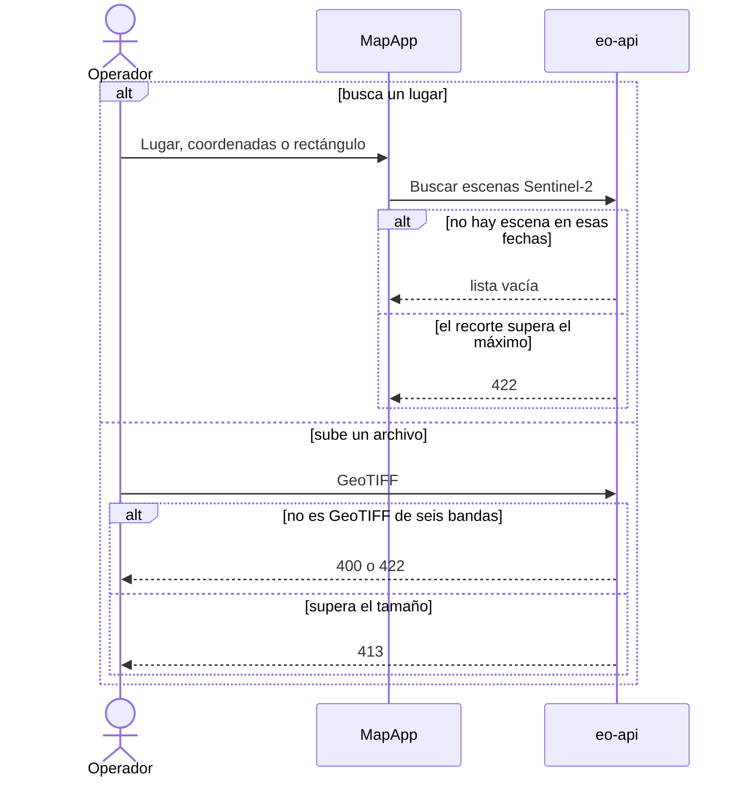

# Diagrama de secuencia — entrada que no llega a análisis

Caso de uso: el operador busca un lugar o sube un GeoTIFF. Si la entrada no
cumple el contrato, la aplicación no guarda un resultado.

```mermaid
sequenceDiagram
  actor Op as Operador
  participant UI as MapApp
  participant API as eo-api

  alt busca un lugar
    Op->>UI: Lugar, coordenadas o rectángulo
    UI->>API: Buscar escenas Sentinel-2
    alt no hay escena en esas fechas
      API-->>UI: lista vacía
    else el recorte supera el máximo
      API-->>UI: 422
    end
  else sube un archivo
    Op->>API: GeoTIFF
    alt no es GeoTIFF de seis bandas
      API-->>Op: 400 o 422
    else supera el tamaño
      API-->>Op: 413
    end
  end
```
